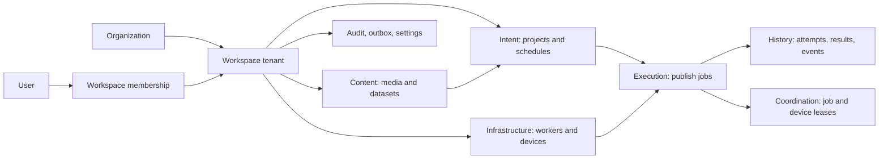
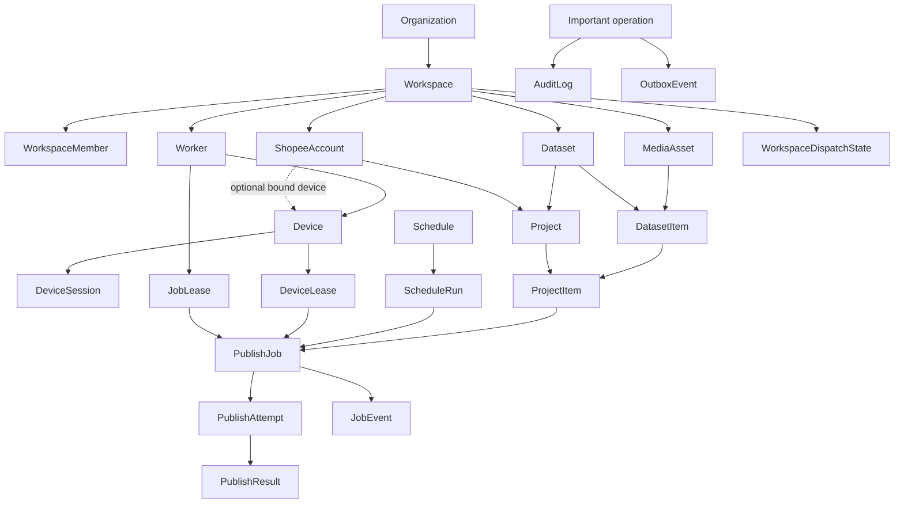
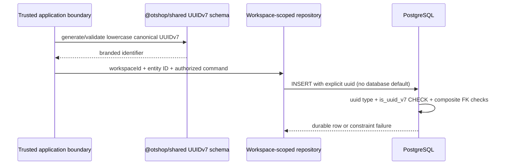
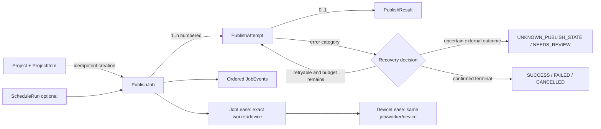

# Database developer guide

Status: database acceptance-gate reference updated through Phase 2 Slice 2.4. This guide explains the implemented schema and application authentication boundary; it does not authorize Slice 2.5 behavior.

Sources of truth, in precedence order:

1. Applied SQL migrations in `packages/database/prisma/migrations/` for the physical contract.
2. `packages/database/prisma/schema.prisma` for the Prisma model and relation contract.
3. Shared contracts in `packages/shared` for values deliberately shared with application code.
4. This guide for navigation and safe-use rules. A unit test fails when its model inventory drifts from Prisma.

## Mental model

An organization owns workspaces. A workspace is the tenant and authorization boundary. Users are global identities that gain workspace access through memberships. All operational content, workers, devices, projects, jobs, and execution history belong to a workspace.

The key rule is: carrying a UUID is not enough. Tenant repositories must carry the authenticated `workspaceId`, authorize the caller, and query or mutate with that workspace predicate. Composite foreign keys make most accidental cross-workspace writes fail at the database boundary.

## Major data flows

The arrows express business flow, not always foreign-key direction. In particular, leases reference the publish job, and `AuditLog` records an operation rather than owning it.

## Schema groups

| Required classification | Models | Meaning |
| --- | --- | --- |
| USER-FACING DOMAIN | `Organization`, `Workspace`, `ShopeeAccount`, `MediaAsset`, `Dataset`, `DatasetItem`, `MediaImportBatch`, `MediaImportBatchItem`, `Schedule`, `Project`, `ProjectItem`, `ProductReference`, `ProjectItemProduct` | Tenant roots plus operator-configured content and publish intent |
| INTERNAL APPLICATION | `ScheduleRun`, `PublishJob`, `PublishAttempt`, `PublishResult` | Durable execution plan and outcome; expose through workflows, never generic table CRUD |
| WORKER INFRASTRUCTURE | `Worker`, `WorkerCredential`, `WorkerEnrollmentToken`, `Device`, `DeviceSession`, `JobLease`, `DeviceLease`, `WorkspaceDispatchState` | Trusted worker registration, device observation, assignment, and fairness; not direct UI concepts |
| OBSERVABILITY | `JobEvent`, `AuditLog`, `OutboxEvent` | Domain timeline, accountability, and reliable delivery; query through purpose-built views |
| SECURITY / AUTHORIZATION | `User`, `UserCredential`, `UserSession`, `Role`, `Permission`, `RolePermission`, `UserSystemRole`, `WorkspaceMember` | Login identity, session material, fixed RBAC policy, and grants |
| CONFIGURATION | `SystemSetting`, `WorkspaceSetting` | Versioned, non-secret settings; edit only through validated setting services |

## Complete model inventory

`R` means delete is restricted; `C` means a deliberately purged parent cascades; `N` means the optional parent reference becomes null. “Workspace” in the owner column means the row has a tenant key and its tenant relationships use composite foreign keys unless specifically noted.

<!-- model-inventory:start -->
| Model | Purpose / visibility | Owner or root | Parents → important children | Identity, uniqueness, delete, lifecycle |
| --- | --- | --- | --- | --- |
| `User` | Global login identity; user-facing | Global | → credentials, sessions, grants, memberships, attributed records | Unique case-insensitive email; credentials/sessions C, business attribution R; enum `UserStatus` |
| `UserCredential` | Password verifier and lockout state; security-internal | User | User → none | One row per user; C with approved user purge; timestamps/lock fields drive lifecycle |
| `UserSession` | Hashed application session; security-internal | User | User → none | Unique token hash; C with user; expiry/revocation timestamps drive lifecycle |
| `Organization` | Administrative grouping; user-facing | Root | → workspaces, optional audit attribution | Unique case-insensitive slug; workspaces R, audit organization N; free-text status |
| `Workspace` | Tenant and authorization boundary; user-facing | Organization | Organization → every tenant group | Unique organization/slug and organization/id; operational children mainly R, settings/dispatch C, audit/outbox N; free-text status |
| `Role` | Fixed RBAC role definition; security-internal | Global policy | → permission mappings and grants | Unique enum code; migration trigger protects fixed rows and scope; joins C but grants R |
| `Permission` | Fixed capability definition; security-internal | Global policy | → role mappings | Unique code; migration protects seeded rows; mappings C |
| `RolePermission` | Fixed role-to-capability join; security-internal | Role + permission | Both parents → none | Composite PK; C only with deliberately removable policy rows |
| `UserSystemRole` | Global system grant; security-internal | User + system role | User, role, grantor → none | Composite PK; all parents R; trigger requires `SYSTEM` role scope |
| `WorkspaceMember` | A user's workspace access and role; security/user-facing | Workspace | Workspace, user, workspace role, inviter → none | Unique workspace/user; parents R; trigger requires `WORKSPACE` role; free-text status |
| `ShopeeAccount` | Local future-target reference, never credentials; user-facing | Workspace | Workspace, optional dormant bound device → projects, products, jobs, expected sessions | Unique display name and partial operator reference per workspace; ACTIVE/ARCHIVED lifecycle; all references R |
| `Worker` | Workspace-specific worker registration; infrastructure | Workspace | Workspace → credentials, devices, sessions, attempts, leases | Unique name and instance key per workspace; credentials C, operational history R; free-text status/platform |
| `WorkerCredential` | Hashed worker secret; security/infrastructure | Workspace + worker | Worker → none | Globally unique hash; C only with worker purge; expiry/revocation timestamps drive lifecycle |
| `WorkerEnrollmentToken` | One-use hashed enrollment token; security/infrastructure | Workspace | Workspace, creating user → none | Globally unique hash; parents R; expiry/used timestamps drive lifecycle |
| `Device` | Authorized ADB device record; infrastructure/user-facing | Workspace + worker | Workspace, worker → sessions, account bindings, projects, jobs, attempts, leases | Unique serial per workspace; unique workspace/worker/id proves assignment; all operational references R; free-text status |
| `DeviceSession` | Observed worker-device session; infrastructure | Workspace + worker + device | Workspace, matching worker/device, optional expected account → none | Partial unique one open session/device; parents R; free-text status plus ended timestamp |
| `MediaAsset` | Immutable content metadata and storage pointer; user-facing | Workspace | Workspace → dataset/project/job references | Unique digest and storage key per workspace; references R; free-text status/orientation |
| `Dataset` | Ordered reusable media collection; user-facing | Workspace | Workspace, creator → items and projects | Unique name per workspace; items C only when no project reference blocks deletion; free-text status |
| `DatasetItem` | Media placement and overrides in a dataset; user-facing | Workspace + dataset | Dataset, media → project items | Unique media and position per dataset; dataset C, media/project references R; no status |
| `MediaImportBatch` | Bounded staged media import; user-facing | Workspace | Workspace, creator, optional dataset → batch items | Unique workspace/id; dataset and creator R; explicit bounded lifecycle and optimistic version |
| `MediaImportBatchItem` | Deterministic per-input import result; user-facing | Workspace + batch | Batch, optional media → none | Unique input index/batch and workspace/id; batch C, media R; bounded explicit outcome |
| `Schedule` | Scheduling template; user-facing | Workspace | Workspace, creator → projects and runs | Unique name per workspace; references R; enum kind, free-text status/DST policies |
| `Project` | Local future-publish configuration over a Dataset; user-facing | Workspace | Dataset, optional account/device/schedule, creator → items/jobs | Unique name per workspace; explicit DRAFT/READY/ARCHIVED lifecycle, bounded daily target/window, optimistic version; no execution in Slice 3.6 |
| `ProjectItem` | Stable project materialization of a dataset item; user-facing | Workspace + project | Project, dataset item, media → future product joins/jobs | Unique source item and non-negative deferrable position per project; ACTIVE/ARCHIVED lifecycle; configured rows are preserved |
| `ProductReference` | Local unverified AffiliateProduct configuration; user-facing | Workspace + account | ACTIVE account → future project-item joins | Partial unique operator reference per account; joins R; MANUAL source and ACTIVE/ARCHIVED lifecycle |
| `ProjectItemProduct` | Primary AffiliateProduct assignment; user-facing | Project item | Project item + product | Composite PK, one row per item, position fixed to zero; C with item, product R; lifecycle follows parents |
| `ScheduleRun` | Idempotent occurrence of a schedule; internal | Workspace + schedule | Schedule → publish jobs | Unique schedule/time/local occurrence; references R; free-text status |
| `PublishJob` | Durable publish intent and state machine; internal/operator-visible | Workspace | Project, item, account, media, optional device/run/retry, creator → attempts, leases, events | Unique SHA-256 idempotency key per workspace; all references R; canonical job status/publisher/priority/error enums and SQL transition trigger |
| `PublishAttempt` | Numbered execution try; internal/operator-visible | Workspace + job | Job, matching worker/device → result/events | Unique attempt number/job and workspace/job/id; parents R; free-text status, enum error category |
| `PublishResult` | At most one result per attempt; internal/operator-visible | Workspace + job + attempt | Matching attempt/job → none | Unique attempt and composite job/attempt FK; parents R; free-text outcome/status value |
| `JobLease` | Exclusive job offer/claim to an exact worker/device; infrastructure | Workspace + job | Job, matching worker/device → device lease | Unique token; partial unique active lease/job; assignment tuple unique; parents/child R; enum lease status |
| `DeviceLease` | Exclusive device reservation paired to a job lease; infrastructure | Workspace + job lease | Exact job/worker/device assignment → none | Partial unique active lease/device; five-column FK proves it matches job lease; parents R; enum lease status |
| `JobEvent` | Ordered append-only job-domain timeline; observability | Workspace + job | Job, optional matching attempt → none | Unique sequence/job; parents R; SQL rejects UPDATE/DELETE; event/actor/status text is versioned by producers |
| `AuditLog` | Append-only who-did-what record; security/observability | Optional workspace/organization | Optional tenant roots → none | SQL rejects UPDATE/DELETE; roots N to retain history; actor/resource/request identifiers retained |
| `OutboxEvent` | Transactional async-delivery record; infrastructure | Optional workspace | Optional workspace → dispatcher | Workspace N; publication/attempt timestamps drive lifecycle; payload is sanitized JSON |
| `WorkspaceDispatchState` | Persisted fairness cursor; infrastructure | Workspace | Workspace → none | One row per workspace; C only during approved workspace purge; versioned counter |
| `SystemSetting` | Versioned non-secret global configuration; internal | Global | Updating user → none | Key is PK; user R; JSON schema selected by key/version; no status |
| `WorkspaceSetting` | Versioned non-secret tenant configuration; internal | Workspace | Workspace and updating user → none | Composite workspace/key PK; workspace C, user R; JSON schema selected by key/version |
<!-- model-inventory:end -->

## Workspace ownership matrix

“Composite tenant FK” means a relationship carries `workspace_id` alongside the child identifier. “Direct root only” is safe when the model has no other tenant-owned parent to pair with.

<!-- ownership-matrix:start -->
| Model | Workspace scoped? | Composite tenant FK? | Cross-workspace protection | Notes |
| --- | --- | --- | --- | --- |
| `User` | No | N/A | Global identity | Workspace access exists only through membership |
| `UserCredential` | No | N/A | Direct global user FK | Security child, not tenant data |
| `UserSession` | No | N/A | Direct global user FK | Login session is global |
| `Organization` | No | N/A | Global root | Owns workspaces |
| `Workspace` | Tenant root | N/A | Direct organization FK; unique `(organizationId, id)` | `id` is the tenant boundary |
| `Role` | No | N/A | Global seeded policy | Scope trigger separates system/workspace roles |
| `Permission` | No | N/A | Global seeded policy | No tenant ownership |
| `RolePermission` | No | N/A | Global role and permission FKs | Fixed policy join |
| `UserSystemRole` | No | N/A | Global user/role FKs plus scope trigger | System grants only |
| `WorkspaceMember` | Yes | Direct root only | Non-null workspace FK; unique workspace/user; role-scope trigger | User and role are deliberately global references |
| `ShopeeAccount` | Yes | Yes for bound device | `(workspaceId, boundDeviceId)` | Direct workspace root plus optional tenant device |
| `Worker` | Yes | Direct root only | Non-null workspace FK and workspace-scoped uniqueness | Physical host needs a separate registration per workspace |
| `WorkerCredential` | Yes | Yes | `(workspaceId, workerId)` | Cannot attach a credential to another tenant's worker |
| `WorkerEnrollmentToken` | Yes | Direct root only | Non-null workspace FK | Creating user is global attribution, not tenant ownership proof |
| `Device` | Yes | Yes | `(workspaceId, workerId)` | Also exposes unique `(workspaceId, workerId, id)` for exact assignment checks |
| `DeviceSession` | Yes | Yes | Matching workspace/worker/device plus workspace/account FKs | Cannot claim a device owned by another worker |
| `MediaAsset` | Yes | Direct root only | Non-null workspace FK and workspace-scoped digest/storage uniqueness | No tenant parent besides workspace |
| `Dataset` | Yes | Direct root only | Non-null workspace FK and workspace-scoped name | Creator is global attribution |
| `DatasetItem` | Yes | Yes | Workspace-qualified dataset and media FKs | Both parents must be in the row's workspace |
| `MediaImportBatch` | Yes | Yes | Workspace-qualified optional Dataset FK | Creator is global attribution |
| `MediaImportBatchItem` | Yes | Yes | Workspace-qualified batch and optional media FKs | Input index is unique within the batch |
| `Schedule` | Yes | Direct root only | Non-null workspace FK and workspace-scoped name | Creator is global attribution |
| `Project` | Yes | Yes | Workspace-qualified Dataset and optional account/device/schedule FKs | Slice 3.6 validates active Dataset and optional local account; future publish pre-flight remains required |
| `ProjectItem` | Yes | Yes | Workspace-qualified project, dataset-item, and media FKs | Media equality with dataset item is not DB-proven |
| `ProductReference` | Yes | Yes | `(workspaceId, accountId)` | Operator reference uniqueness is account/workspace scoped |
| `ProjectItemProduct` | Yes | Yes | Workspace-qualified project-item and product FKs | Prevents cross-tenant product attachment |
| `ScheduleRun` | Yes | Yes | `(workspaceId, scheduleId)` | Occurrence uniqueness is schedule scoped |
| `PublishJob` | Yes | Yes | All tenant parents and retry parent are workspace-qualified | Creator is global attribution; semantic project graph remains an application invariant |
| `PublishAttempt` | Yes | Yes | Workspace-qualified job, worker, and exact worker/device FKs | Assignment correction is database-enforced |
| `PublishResult` | Yes | Yes | Workspace/job/attempt composite FK | Attempt must belong to the same job and workspace |
| `JobLease` | Yes | Yes | Workspace-qualified job/worker and exact worker/device FKs | Exact assignment tuple is unique |
| `DeviceLease` | Yes | Yes | Full workspace/job/worker/device/job-lease FK | Must describe the exact paired job lease |
| `JobEvent` | Yes | Yes | Workspace/job and optional workspace/job/attempt FKs | Append-only tenant history |
| `AuditLog` | Optional | No | Optional direct workspace and organization FKs | If both are set, their mutual consistency is an application invariant |
| `OutboxEvent` | Optional | Direct optional root | Optional workspace FK | Null workspace is only for genuine system events |
| `WorkspaceDispatchState` | Yes | Direct root only | Workspace PK/FK | One row per workspace |
| `SystemSetting` | No | N/A | Global updater user FK | Non-secret global configuration |
| `WorkspaceSetting` | Yes | Direct root only | Workspace is part of composite PK and FK | Updater user is global attribution |
<!-- ownership-matrix:end -->

Attribution fields such as `createdByUserId`, `updatedByUserId`, and `actorId` prove identity, not current membership. The authorization service must separately prove that the actor may act in the workspace.

## UUIDv7 lifecycle

Every standalone `id` primary key is an application-generated canonical UUIDv7 value. Join/settings models instead use parent IDs or text keys as their composite primary key. PostgreSQL stores native `uuid`, provides no implicit ID default, and migration checks reject UUIDv4 or malformed-version standalone primary IDs. `PublishJob.executionSlotId` and `AuditLog.requestId` are also UUIDv7-checked correlation identifiers. Nullable polymorphic identifiers (`actorId`, `resourceId`, `aggregateId`) cannot always have a concrete FK, so producers must validate them according to their declared type. Never use random UUIDv4, database-generated UUIDs, user-supplied IDs, or unchecked casts for a protected identifier.

## Status and lifecycle fields

### Canonical database enums

| Enum | Values | Ownership |
| --- | --- | --- |
| `UserStatus` | `ACTIVE`, `SUSPENDED`, `DEACTIVATED` | Identity contract |
| `RoleCode` | `SUPER_ADMIN`, `ADMIN`, `SUPERVISOR`, `OPERATOR`, `VIEWER` | Seeded RBAC contract |
| `RoleScope` | `SYSTEM`, `WORKSPACE` | Seeded RBAC contract |
| `ConnectionType` | `USB`, `WIRELESS_ADB` | Device protocol |
| `MediaSource` | `LOCAL_FILE`, `MANUAL_UPLOAD` | Media ingestion |
| `ProductSource` | `MANUAL` | Product entry |
| `ScheduleKind` | `IMMEDIATE_TEMPLATE`, `ONCE`, `RECURRING` | Scheduler |
| `LeaseStatus` | `OFFERED`, `ACTIVE`, `RELEASED`, `EXPIRED` | Worker protocol |
| `PublisherKind` | `MOCK`, `SHOPEE_OFFICIAL_API`, `SHOPEE_ANDROID` | Publishing capability |
| `PublishJobStatus` | `DRAFT`, `QUEUED`, `PREPARING`, `WAITING_FOR_DEVICE`, `WAITING_FOR_AUTH`, `PROCESSING_MEDIA`, `UPLOADING`, `VERIFYING`, `SUCCESS`, `RETRYING`, `PAUSED`, `CANCELLED`, `FAILED`, `UNKNOWN_PUBLISH_STATE`, `NEEDS_REVIEW` | Shared job state machine plus SQL transition trigger |
| `JobPriority` | `URGENT`, `HIGH`, `NORMAL`, `LOW` | Dispatcher |
| `ErrorCategory` | `RETRYABLE`, `NON_RETRYABLE`, `MANUAL_REVIEW_REQUIRED` | Shared recovery contract |

### Complete lifecycle-field classification

This inventory excludes ordinary `createdAt`/`updatedAt` audit timestamps. A row containing several fields lists every field in that lifecycle group.

| Entity | Field(s) | Classification | Current meaning |
| --- | --- | --- | --- |
| `User` | `status` | CANONICAL ENUM | `UserStatus` |
| `User` | `lastLoginAt` | TIMESTAMP-DERIVED | Last successful login |
| `UserCredential` | `passwordChangedAt`, `lockedUntil` | TIMESTAMP-DERIVED | Credential rotation and temporary lock window |
| `UserSession` | `expiresAt`, `lastSeenAt`, `revokedAt` | TIMESTAMP-DERIVED | Valid only while unexpired and not revoked |
| `Organization` | `status` | VALIDATED TEXT | Slice 2.4 contract: `ACTIVE`, `SUSPENDED`; unknown denies access |
| `Workspace` | `status` | VALIDATED TEXT | Slice 2.4 contract: `ACTIVE`, `SUSPENDED`; unknown denies access |
| `Role` | `code`, `scope` | CANONICAL ENUM | Fixed role identity and grant scope |
| `WorkspaceMember` | `status` | VALIDATED TEXT | Slice 2.4 contract: `ACTIVE`, `SUSPENDED`, `REVOKED`; only `ACTIVE` authorizes |
| `WorkspaceMember` | `joinedAt` | TIMESTAMP-DERIVED | Join completion evidence |
| `ShopeeAccount` | `status` | CONSTRAINED TEXT | `ACTIVE`, `ARCHIVED` local-record lifecycle only |
| `ShopeeAccount` | `lastVerifiedAt` | TIMESTAMP-DERIVED | Dormant legacy field; Slice 4.1 never writes it |
| `Worker` | `status`, `platform` | UNCONSTRAINED TEXT | Protocol vocabularies deferred |
| `Worker` | `lastHeartbeatAt` | TIMESTAMP-DERIVED | Liveness observation, not a durable status by itself |
| `WorkerCredential` | `expiresAt`, `lastUsedAt`, `revokedAt` | TIMESTAMP-DERIVED | Credential validity/use/revocation |
| `WorkerEnrollmentToken` | `expiresAt`, `usedAt` | TIMESTAMP-DERIVED | Token validity and one-time consumption evidence |
| `Device` | `connectionType` | CANONICAL ENUM | `ConnectionType` |
| `Device` | `status` | UNCONSTRAINED TEXT | Vocabulary deferred |
| `Device` | `shopeeInstalled` | BOOLEAN | Observed installed/not-installed/unknown fact |
| `Device` | `lastSeenAt` | TIMESTAMP-DERIVED | Most recent observation |
| `DeviceSession` | `status`, `endReason` | UNCONSTRAINED TEXT | Session state/reason vocabularies deferred |
| `DeviceSession` | `startedAt`, `lastHeartbeatAt`, `endedAt` | TIMESTAMP-DERIVED | Session interval and liveness |
| `MediaAsset` | `source` | CANONICAL ENUM | `MediaSource` |
| `MediaAsset` | `status`, `orientation`, `validationErrorCode` | VALIDATED TEXT | Slice 3.2 application contract defines the five inspection statuses, four rotation values, and bounded permanent/transient failure codes |
| `Dataset` | `status` | UNCONSTRAINED TEXT | Vocabulary deferred |
| `Schedule` | `kind` | CANONICAL ENUM | `ScheduleKind` |
| `Schedule` | `status`, `dstGapPolicy`, `dstOverlapPolicy` | UNCONSTRAINED TEXT | Scheduler vocabularies deferred |
| `Schedule` | `nextRunAt`, `endAt` | TIMESTAMP-DERIVED | Scheduler eligibility/window |
| `Project` | `publisherKind` | CANONICAL ENUM | `PublisherKind` |
| `Project` | `status` | CONSTRAINED TEXT | `DRAFT`, `READY`, `ARCHIVED` |
| `Project` | `captionMode` | UNCONSTRAINED TEXT | Template/caption behavior remains deferred; Slice 3.6 uses only the dormant safe default |
| `ProjectItem` | `status` | CONSTRAINED TEXT | `ACTIVE`, `ARCHIVED`; Slice 4.2 creates only ACTIVE rows |
| `ProductReference` | `source` | CANONICAL ENUM | `ProductSource` |
| `ProductReference` | `status` | CONSTRAINED TEXT | `ACTIVE`, `ARCHIVED` |
| `ScheduleRun` | `status`, `errorCode` | UNCONSTRAINED TEXT | Run/error vocabularies deferred |
| `ScheduleRun` | `startedAt`, `completedAt` | TIMESTAMP-DERIVED | Run execution interval |
| `PublishJob` | `publisherKind`, `status`, `priority`, `lastErrorCategory` | CANONICAL ENUM | Shared publisher/job/priority/error contracts |
| `PublishJob` | `lastErrorCode`, `recoveryNote` | UNCONSTRAINED TEXT | Sanitized error/recovery detail; code vocabulary deferred |
| `PublishJob` | `cancelRequestedAt`, `startedAt`, `completedAt` | TIMESTAMP-DERIVED | Cancellation and execution milestones; terminal jobs require completion |
| `PublishAttempt` | `status`, `errorCode` | UNCONSTRAINED TEXT | Attempt/error vocabularies deferred |
| `PublishAttempt` | `errorCategory` | CANONICAL ENUM | Shared recovery category |
| `PublishAttempt` | `startedAt`, `submittedAt`, `endedAt` | TIMESTAMP-DERIVED | Attempt execution/submission interval |
| `PublishResult` | `outcome`, `statusValue` | UNCONSTRAINED TEXT | Outcome and adapter-owned provider status vocabularies deferred |
| `PublishResult` | `publishedAt`, `verifiedAt` | TIMESTAMP-DERIVED | Observed publication and verification times |
| `JobLease` | `status` | CANONICAL ENUM | `LeaseStatus` |
| `JobLease` | `offeredAt`, `ackDeadlineAt`, `expiresAt`, `acknowledgedAt`, `lastRenewedAt`, `releasedAt` | TIMESTAMP-DERIVED | Offer, validity, renewal, and release lifecycle |
| `DeviceLease` | `status` | CANONICAL ENUM | `LeaseStatus` |
| `DeviceLease` | `offeredAt`, `ackDeadlineAt`, `expiresAt`, `acknowledgedAt`, `lastRenewedAt`, `releasedAt` | TIMESTAMP-DERIVED | Matching device reservation lifecycle |
| `JobEvent` | `fromStatus`, `toStatus` | CANONICAL ENUM | `PublishJobStatus` snapshots |
| `JobEvent` | `eventType`, `actorType` | UNCONSTRAINED TEXT | Producer vocabularies deferred |
| `AuditLog` | `action` | VALIDATED TEXT | Auth paths use the seven canonical Slice 2.4 actions; later domains extend deliberately |
| `AuditLog` | `actorType`, `resourceType` | VALIDATED TEXT | Auth repositories allow only their explicit actor/resource unions; later domains extend deliberately |
| `OutboxEvent` | `topic`, `aggregateType`, `lastError` | UNCONSTRAINED TEXT | Delivery taxonomy/error detail deferred |
| `OutboxEvent` | `availableAt`, `publishedAt` | TIMESTAMP-DERIVED | Delivery eligibility and completion |
| `WorkspaceDispatchState` | `lastDispatchedAt` | TIMESTAMP-DERIVED | Fairness history |

VALIDATED TEXT means the owning application boundary uses the canonical shared schema even though PostgreSQL still stores `text`. Database checks also validate non-lifecycle text contracts such as `ShopeeAccount.countryCode` and `PublishJob.idempotencyKey`. Supporting integer counters (`failedAttempts`, attempt counts, versions, dispatch counts, schema versions) have database lower-bound checks but are not statuses.

### Status decisions required later

These columns are structurally present but are not yet controlled vocabularies. Do not invent values ad hoc. Validate them at the application boundary once their owning phase establishes the contract, then promote stable finite vocabularies to shared/database enums or checks.

| Entity | Field(s) | Current representation | Why not canonical yet | Finalize in |
| --- | --- | --- | --- | --- |
| `MediaAsset` | later processing/retention statuses | Unconstrained text | Inspection is finalized, but derivative-processing and retention lifecycle semantics do not exist yet | Later Phase 3 media slices |
| `Dataset` | `status` | Unconstrained text | Archive/edit behavior is not implemented | Phase 3 |
| `Project` | `captionMode` and execution policy fields | Unconstrained/dormant | Caption templates, retry/rate profiles, and publish pre-flight are not implemented | Later project/job slices |
| `PublishAttempt` | `status`, `errorCode` | Unconstrained text | Attempt protocol/recovery vocabulary belongs to the job engine | Phase 5 |
| `PublishResult` | `outcome`, `statusValue` | Unconstrained text | Result vocabulary depends on verified adapter semantics | Phase 5 |
| `JobEvent` | `eventType`, `actorType` | Unconstrained text | Event taxonomy must follow implemented job commands | Phase 5 |
| `AuditLog` | non-auth `actorType`, `action`, `resourceType` values | Text with an auth-specific validated subset | Slice 2.4 finalized only authentication events; future commands need their own vocabulary | Extend in each owning phase before its first audited command |
| `OutboxEvent` | `topic`, `aggregateType` | Unconstrained text | Topics must follow actual consumers and versioning rules | Phase 5 before dispatch consumers |
| `Worker` | `status`, `platform` | Unconstrained text | Compatibility and heartbeat protocol is not implemented | Phase 6 |
| `DeviceSession` | `status`, `endReason` | Unconstrained text | Session handshake/termination protocol is not implemented | Phase 6 |
| `Device` | `status` | Unconstrained text | Observation/offline/retirement semantics belong to the device layer | Phase 7 |
| `Schedule` | `status`, `dstGapPolicy`, `dstOverlapPolicy` | Unconstrained text | Scheduling/DST behavior is intentionally deferred | Phase 11 |
| `ScheduleRun` | `status`, `errorCode` | Unconstrained text | Run execution/recovery is intentionally deferred | Phase 11 |

Free text is a deferral, not permission for arbitrary strings. Code must evaluate both enum/text status and time where both exist.

## Delete and retention semantics

Default behavior is lifecycle transition, not physical deletion:

- Removing a user from a workspace deactivates `WorkspaceMember`; it does not delete the global user or erase attribution.
- Accounts, workers, devices, media, datasets, projects, schedules, and products are disabled, retired, or archived once their owning vocabulary exists.
- Workspaces and organizations cannot be deleted while restricted descendants exist. An approved purge must order deletions explicitly. Only workspace settings and dispatch state cascade; audit/outbox tenant references become null so retained history survives.
- A dataset can cascade its items only after project references are gone. A project item can cascade its product join rows, but jobs restrict deletion of the item and project.
- Workers cascade credentials only during an approved purge. Devices, sessions, attempts, and leases restrict deletion to preserve execution evidence.
- User credentials and sessions cascade only if the user itself is legally and operationally eligible for purge. Business attribution restricts ordinary deletion; privacy workflows should anonymize where required.
- Storage object deletion is a separate policy operation after all database references and retention holds are checked. Database cascades never delete files.
- `JobEvent` and `AuditLog` are append-only at SQL level. Attempts, results, leases, and jobs are retained history and are protected by restrictive relationships, although their legitimate lifecycle fields may be updated.

## Publishing and recovery model

`PublishJob` is the durable intent and only canonical publish state machine. Its per-workspace SHA-256 idempotency key is the race barrier. The SQL trigger enforces the same allowed transitions as the shared contract, including terminal-state closure and prohibition of unsafe `UPLOADING → QUEUED` recovery. Code must use a transaction for job state, event, and outbox changes.

An attempt is a numbered try, unique by `(jobId, attemptNumber)`. It records the exact matching worker/device. A result is optional and unique per attempt; it must point to an attempt belonging to the same job. Unknown external outcome is not success and must enter review instead of blind retry. `attemptCount`, `maxAttempts`, error category, idempotency, and observed external state jointly determine recovery.

The database proves same-workspace relations, but it does not prove every denormalized semantic equality: a job's account/media/item must still belong to its selected project's intended graph, and `ProjectItem.mediaAssetId` must match its dataset item. The pre-flight service and workspace-scoped job repository must enforce those graph invariants transactionally before job creation.

## Worker, device, and lease model

A worker registration belongs to exactly one workspace. A device belongs to exactly one worker registration inside that workspace. Sessions, attempts, and job leases reference `(workspaceId, workerId, deviceId)`, so they cannot claim a device reported by another worker. A device lease references the full `(workspaceId, jobId, workerId, deviceId, jobLeaseId)` assignment, so it cannot reserve a different device from its paired job lease.

Partial unique indexes permit at most one `OFFERED` or `ACTIVE` job lease per job, and at most one `OFFERED` or `ACTIVE` device lease per device. Lease token material is stored only as a hash. Claim/ack/renew/release logic must use transactions, optimistic versions, deadlines, and affected-row checks; a normal Prisma `find` followed by `update` is not a safe claim algorithm.

## Event, audit, and outbox distinctions

| Record | Question answered | Write rule |
| --- | --- | --- |
| `JobEvent` | What happened to this job, in what order? | Append in the same transaction as the job change; allocate a unique per-job sequence; never update/delete |
| `AuditLog` | Who performed which security/business action on what resource? | Append sanitized before/after evidence; tenant may be null only for system action; never update/delete |
| `OutboxEvent` | What integration message still needs reliable delivery? | Insert with the business transaction; dispatcher retries and sets delivery fields; payload contains no secrets |
| `WorkspaceDispatchState` | Which workspace was served least recently for fair dispatch? | Update transactionally when dispatch succeeds; it is a fairness cursor, not domain history or a message |

One action may correctly produce the first three records and update dispatch state. They are not interchangeable: the outbox is transport state, the job event is domain history, the audit log is accountability evidence, and dispatch state is a mutable scheduling cursor.

## Naming glossary

| Term | Meaning |
| --- | --- |
| organization | Administrative owner of one or more workspaces; not the tenant query boundary |
| workspace | Tenant, authorization, uniqueness, and fairness boundary |
| account | Authorized Shopee account reference; never a stored Shopee password/session secret |
| dataset | Reusable ordered collection of media and per-item overrides |
| worker | Workspace-specific trusted software registration |
| device | Authorized Android/ADB target currently assigned to one worker record |
| session | Time-bounded observation of a worker using a device, not a user login |
| project | Reusable publish configuration and policy |
| project item | Stable, ordered materialization of a dataset item for a project |
| publish job | One idempotent durable publication intent (`PublishJob`) |
| publish attempt | One execution try for a job (`PublishAttempt`) |
| publish result | The persisted outcome returned by one attempt (`PublishResult`) |
| job lease | Exclusive time-bounded assignment of a job to an exact worker/device |
| device lease | Matching exclusive reservation of that device for the job assignment |
| event | Ordered job-domain fact |
| audit | Append-only actor/resource accountability fact |
| outbox | Transactionally staged message awaiting external delivery |
| publisher | Adapter contract/capability selected by `PublisherKind`; not a database-owned external API assumption |

One genuine naming hazard remains intentionally unchanged: the Prisma `PublishResult` model is the persisted result row, while `@otshop/shared` exports a `PublishResult` type for an adapter call's success/error return. Use explicit import aliases such as `PublisherCallResult` at boundaries. Also, unqualified “lease” is ambiguous; say `JobLease` or `DeviceLease` in code and design discussions.

## Safe access rules

- Application features import database access through `@otshop/database`; they do not instantiate unscoped Prisma clients elsewhere.
- A tenant repository takes an authorized workspace context and scopes the initial query, nested connects, updates, deletes, counts, and uniqueness lookups. Never fetch globally by `id` and authorize afterward.
- Prefer composite tenant selectors and connect records through workspace-qualified keys. Treat a foreign-key error as defense in depth, not expected authorization control.
- Create UUIDv7 IDs at the trusted application boundary and validate all IDs crossing HTTP, queue, worker, or configuration boundaries.
- Use transactions for state transition + event + outbox, claims/leases, counters, and multi-row materialization. Use optimistic `version` checks where present.
- Never write `PublishJob.status` through generic CRUD or raw SQL. Route it through the canonical transition service; the SQL trigger is the final backstop, not the primary API.
- Never update or delete append-only `JobEvent` or `AuditLog` rows. Approved retention requires a separately designed privileged path.
- Validate and size-bound every JSON payload before persistence. Store only sanitized metadata; secrets belong in secret storage and authenticators are hashed.
- Prisma `@updatedAt` is client-managed. Raw SQL writers must explicitly set `updated_at` and honor version/transition invariants.
- Migrations are authoritative schema history. Use `prisma migrate` workflows; never use `prisma db push` against shared, test, staging, or production databases.
- RLS is not enabled. Composite tenant keys and mandatory scoped repositories are the implemented controls until transaction-local RLS behavior is designed and integration-tested.

## Common mistakes and unresolved decisions

- Confusing a same-workspace FK with authorization. It prevents tenant mixing but does not prove the caller may see the row.
- Looking up a row by globally unique ID without `workspaceId`, especially before an update or nested connect.
- Treating nullable workspace attribution on audit/outbox as permission to omit known tenant context.
- Inventing values for unresolved text statuses, actor/event types, platform, orientation, caption, DST, outcome, or provider status fields.
- Assuming repeated job/project/media/account IDs are semantically consistent merely because each belongs to the same workspace. Pre-flight must validate the intended graph.
- Assuming `ProjectItem.mediaAssetId` is database-proven equal to `DatasetItem.mediaAssetId`; this remains an application invariant.
- Reopening or blindly retrying an upload whose external outcome is unknown. Use `UNKNOWN_PUBLISH_STATE`/`NEEDS_REVIEW` and operator reconciliation.
- Updating append-only history, storing secrets or raw diagnostic data in JSON, or exposing storage keys as trusted file paths.
- Relying on application checks alone for lease exclusivity, or ignoring expiry and optimistic versions.
- Treating an enrollment token as consumed after a read. Phase 6 must atomically update only a matching hash whose `usedAt` is null and `expiresAt` is still in the future, then require exactly one affected row.
- Physically deleting roots to represent normal deactivation. Retention/purge, privacy anonymization, and storage cleanup workflows still require explicit implementation.
- Assuming database enums are exhaustive product policy forever. Additions require a coordinated shared-contract, migration, code, and test change.

Before each owning phase writes an unresolved text category, finalize its vocabulary, transitions, terminal behavior, compatibility policy, and migration strategy. Before Phase 5 job creation, implement semantic project-graph validation. Before Phase 6 claims, specify transactional lease SQL and time authority. Before enabling RLS, prove Prisma pooling and transaction-local tenant context in integration tests.

## Authentication and authorization boundary

Slice 2.4 implements this sequence on the server: hashed session token lookup → active user → requested workspace hint → active membership/workspace/organization → canonical role permissions → workspace-scoped repository. The workspace cookie and request body are untrusted hints. Composite foreign keys answer whether a resulting relationship can exist; RBAC answers whether this actor may request it. Both checks remain mandatory.

Authentication repositories expose explicit identity, session, membership, audit, and bootstrap operations. They return allowlisted records and never serialize `UserCredential` or raw token material. Session creation, rotation, logout/revocation, bootstrap, and their required audits are transactional.
