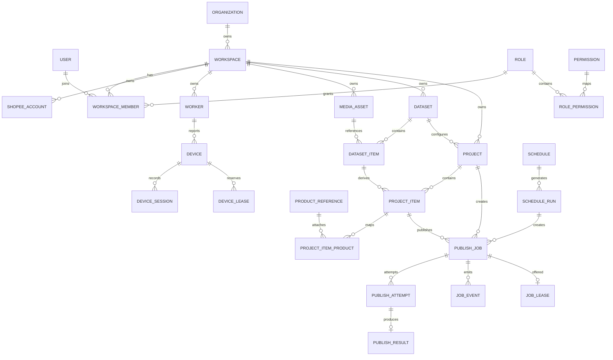

# Relational database design

Status: authoritative Phase 1 logical schema; implemented in Phase 2 Slice 2.3 migrations

Target: PostgreSQL with Prisma migrations

## Conventions

- Primary keys are UUID v7 values generated by the application. PostgreSQL stores them as `uuid`.
- Business timestamps are `timestamptz` in UTC. Every mutable entity has non-null `created_at` and `updated_at`.
- Tenant entities have a non-null `workspace_id` and `UNIQUE (workspace_id, id)` so composite foreign keys can prove same-workspace relationships.
- Names use `text`; bounded protocol values use database enums or checked `text` columns.
- Flexible `jsonb` is allowed only for sanitized provider metadata that is not queried as core business state.
- Optimistically updated records have non-null integer `version`, initially `1`.
- All foreign-key columns are indexed unless covered by a more selective composite index.
- Prisma schema declarations are supplemented by SQL migrations for partial unique indexes, check constraints, and locking helpers that Prisma cannot express.

Slice 2.3 uses Prisma CLI/Client `6.19.1`, pinned together for Node.js 22 and PostgreSQL 16 compatibility. UUIDv7 remains application-generated through `@otshop/shared`; PostgreSQL has no UUID default, stores native `uuid`, and additionally rejects non-v7 primary IDs. Critical role, permission, publisher, error-category, job-state, and documented model-inventory drift is covered by tests. The migration-level job transition trigger mirrors the shared Phase 1 table so direct SQL cannot reopen terminal jobs or perform `UPLOADING -> QUEUED`. The acceptance audit also requires every session, attempt, and lease worker/device pair to match the device's registered worker; a device lease must match the complete assignment of its paired job lease.

## Tenant relationship

## Identity and authorization tables

### `users`

| Column | Null | Constraints / meaning |
| --- | --- | --- |
| `id uuid` | no | primary key |
| `email citext` | no | globally unique normalized login email |
| `display_name text` | no | operator-facing name |
| `status user_status` | no | `ACTIVE`, `SUSPENDED`, `DEACTIVATED` |
| `last_login_at timestamptz` | yes | successful application login only |
| `created_at`, `updated_at` | no | audit timestamps |

Indexes: unique `lower(email)`; `(status)`. Delete: `RESTRICT`; deactivate and anonymize instead.

### `user_credentials`

| Column | Null | Constraints / meaning |
| --- | --- | --- |
| `user_id uuid` | no | primary key, FK `users.id` |
| `password_hash text` | no | Argon2id encoded hash for the application login only |
| `password_changed_at timestamptz` | no | rotation/revocation reference |
| `failed_attempts integer` | no | default 0, check >= 0 |
| `locked_until timestamptz` | yes | bounded brute-force protection |
| `created_at`, `updated_at` | no | audit timestamps |

Delete: `CASCADE` when an unreferenced user is purged. This table never stores a Shopee password.

### `user_sessions`

`id uuid` PK; `user_id uuid` non-null FK; `token_hash bytea` non-null unique; `expires_at`, `last_seen_at`, `created_at` non-null; `revoked_at` nullable; sanitized `ip_prefix` and `user_agent_family` nullable. Index `(user_id, expires_at)`. Delete: `CASCADE` with user.

### `organizations`

`id uuid` PK; `name text` non-null; `slug citext` non-null unique; `status text` non-null with the Slice 2.4 application vocabulary `ACTIVE`, `SUSPENDED`; `created_at`, `updated_at` non-null. Unknown values fail authorization closed. Delete: `RESTRICT` while workspaces exist; archive first.

### `workspaces`

`id uuid` PK; `organization_id uuid` non-null FK; `name text` non-null; `slug citext` non-null; `timezone text` non-null IANA identifier; `status text` non-null with the Slice 2.4 application vocabulary `ACTIVE`, `SUSPENDED`; `created_at`, `updated_at` non-null. Unknown values fail authorization closed. Unique `(organization_id, slug)` and `(organization_id, id)`. Index `(organization_id, status)`. Delete: `RESTRICT` while tenant records exist.

### `roles`, `permissions`, and `role_permissions`

`roles`: `id uuid` PK; `code role_code` non-null unique with `SUPER_ADMIN`, `ADMIN`, `SUPERVISOR`, `OPERATOR`, `VIEWER`; `scope role_scope` non-null (`SYSTEM` or `WORKSPACE`); `description text` non-null; timestamps. Fixed roles are migration-seeded and not deleted.

`permissions`: `id uuid` PK; `code text` non-null unique; `description text` non-null; timestamps. Migration-seeded and not deleted.

`role_permissions`: composite PK `(role_id, permission_id)`; both non-null FKs; `created_at` non-null. Delete cascades only from a deliberately removed non-fixed mapping.

`user_system_roles`: composite PK `(user_id, role_id)`; both non-null FKs; `granted_by_user_id uuid` non-null FK; `created_at` non-null. A migration constraint/trigger allows only `roles.scope = SYSTEM`. `SUPER_ADMIN` is assigned here and never through ordinary workspace membership.

### `workspace_members`

`id uuid` PK; `workspace_id uuid` non-null FK; `user_id uuid` non-null FK; `role_id uuid` non-null FK restricted to workspace roles by migration constraint/trigger; `status text` non-null with the Slice 2.4 application vocabulary `ACTIVE`, `SUSPENDED`, `REVOKED`; `invited_by_user_id uuid` nullable FK; `joined_at timestamptz` nullable; timestamps. Only `ACTIVE` authorizes and unknown values fail closed. Unique `(workspace_id, user_id)` and `(workspace_id, id)`. Index `(user_id, status)`. Delete: `RESTRICT` after business activity exists; membership is deactivated to retain attribution.

## Account, worker, and device tables

### `shopee_accounts`

`id uuid` PK; `workspace_id uuid` non-null FK; `display_name text` non-null; `shop_name text` nullable; `operator_reference text` nullable; `country_code char(2)` non-null; `status text` non-null with its vocabulary deferred; `bound_device_id uuid` nullable; `last_verified_at timestamptz` nullable; `created_at`, `updated_at` non-null; `version integer` non-null.

Constraints: unique `(workspace_id, display_name)`; unique `(workspace_id, operator_reference)` where reference is not null; composite FK `(workspace_id, bound_device_id)` to devices, added after both tables. `operator_reference` is manually recorded from authorized visible UI and does not imply an undocumented API identifier. Delete: `RESTRICT`; disable instead.

### `workers`

`id uuid` PK; `workspace_id uuid` non-null FK; `name text` non-null; `instance_key text` non-null; `status text` non-null; `version text` non-null; `platform text` non-null; `last_heartbeat_at timestamptz` nullable; `capabilities jsonb` non-null default `{}` and schema-validated; `created_at`, `updated_at` non-null; `version_counter integer` non-null. Worker status/platform vocabularies are deferred to Phase 6.

Unique `(workspace_id, name)`, `(workspace_id, instance_key)`, and `(workspace_id, id)`. Index `(workspace_id, status, last_heartbeat_at)`. A physical host serving two workspaces uses two registrations and credentials. Delete: `RESTRICT`; revoke instead.

### `worker_credentials` and `worker_enrollment_tokens`

`worker_credentials`: `id uuid` PK; `workspace_id`, `worker_id` non-null with composite FK; `secret_hash bytea` non-null unique; `label text` non-null; `expires_at` nullable; `last_used_at`, `revoked_at` nullable; timestamps. Index `(worker_id, revoked_at)`.

`worker_enrollment_tokens`: `id uuid` PK; `workspace_id` non-null; `token_hash bytea` non-null unique; `created_by_user_id` non-null; `expires_at` non-null; `used_at` nullable; timestamps. The unique hash prevents duplicate stored token material; Phase 6 consumption must atomically require `used_at IS NULL` and an unexpired token. Raw tokens are returned once and never stored.

Delete: credentials cascade only during an approved worker purge; ordinary removal uses revocation.

### `devices`

`id uuid` PK; `workspace_id uuid` non-null FK; `worker_id uuid` non-null; `name text` non-null; `adb_serial text` non-null; `connection_type connection_type` non-null (`USB`, `WIRELESS_ADB`); `ip_address inet` nullable; `status text` non-null with its vocabulary deferred to Phase 7; `android_version text` nullable; `model text` nullable; `shopee_installed boolean` nullable; `shopee_version text` nullable; `last_seen_at timestamptz` nullable; timestamps; `version integer` non-null.

Composite FK `(workspace_id, worker_id)`; unique `(workspace_id, adb_serial)`, `(workspace_id, id)`, and `(workspace_id, worker_id, id)`; indexes `(worker_id, status)` and `(workspace_id, last_seen_at)`. The three-column key lets dependent execution rows prove that their declared worker owns the device. Delete: `RESTRICT`; retire instead.

### `device_sessions`

`id uuid` PK; `workspace_id`, `device_id`, `worker_id` non-null composite FKs, including `(workspace_id, worker_id, device_id)` to the registered device assignment; `expected_account_id uuid` nullable composite FK; `status text` non-null with its vocabulary deferred to Phase 6; `started_at`, `last_heartbeat_at` non-null; `ended_at` nullable; `end_reason text` nullable; `sanitized_facts jsonb` non-null default `{}`; timestamps. Unique partial index allows one open session per device. Delete: `RESTRICT` for audit history.

### `job_leases` and `device_leases`

`job_leases`: `id uuid` PK; `workspace_id`, `job_id`, `worker_id`, `device_id` non-null composite FKs; `lease_token_hash bytea` non-null unique; `status lease_status` non-null (`OFFERED`, `ACTIVE`, `RELEASED`, `EXPIRED`); `offered_at`, `ack_deadline_at`, `expires_at` non-null; `acknowledged_at`, `last_renewed_at`, `released_at` nullable; `version integer` non-null; timestamps.

`device_leases`: `id uuid` PK; `workspace_id`, `device_id`, `worker_id`, `job_id`, `job_lease_id` non-null composite FKs; same status/timestamp/version fields as the job lease.

Partial unique indexes enforce at most one `OFFERED`/`ACTIVE` lease for a job and at most one `OFFERED`/`ACTIVE` lease for a device. Worker/device composite FKs prove device ownership, and the device lease's full job/worker/device/job-lease FK proves that both lease rows describe the same assignment. Delete: `RESTRICT`; expired/released leases are retained for diagnostics according to policy.

## Media and dataset tables

### `media_assets`

`id uuid` PK; `workspace_id uuid` non-null; `source media_source` non-null (`LOCAL_FILE`, `MANUAL_UPLOAD`); `original_filename text` non-null sanitized for display only; `storage_key text` non-null; `mime_type text` non-null; `size_bytes bigint` non-null check > 0; `sha256 bytea` non-null check length 32; `status text` non-null; `duration_ms bigint`, `width integer`, `height integer`, `fps numeric`, `bitrate_bps bigint`, `codec text`, `audio_codec text`, `orientation text`, `thumbnail_key text`, and `thumbnail_generation_started_at timestamptz` nullable; `content_source`, `content_owner`, `license_reference`, `notes` nullable; `validation_error_code text` nullable; timestamps; `version integer` non-null. Slice 3.2 defines `INGESTED`, `INSPECTING`, `READY`, `REJECTED`, and `INSPECTION_FAILED`. READY atomically requires normalized duration, dimensions, frame rate, codec, and orientation; optional bitrate/audio remain nullable. Rejection/failure clears probe metadata and records a bounded validation code. Orientation is `ROTATION_0`, `ROTATION_90`, `ROTATION_180`, or `ROTATION_270`. Slice 3.3 permits a thumbnail key or an active generation timestamp only while status is `READY`, never both; optimistic versioning protects claim, release, stale reclaim, and completion.

Unique `(workspace_id, sha256)` and `(workspace_id, storage_key)`; indexes `(workspace_id, status, created_at)` and `(workspace_id, original_filename)`. Delete: `RESTRICT` while referenced; an application retention workflow tombstones and later removes storage.

### `datasets`

`id uuid` PK; `workspace_id uuid` non-null; `name text` non-null; `description text` nullable; `status text` non-null constrained to `ACTIVE | ARCHIVED`; `created_by_user_id uuid` non-null; timestamps; `version integer` non-null. Unique `(workspace_id, name)` and `(workspace_id, id)`. Slice 3.4 uses the version for metadata and every membership mutation. Archive preserves items and makes the dataset read-only. Delete: `RESTRICT` while projects reference it; the Slice 3.4 API does not hard-delete.

### `dataset_items`

`id uuid` PK; `workspace_id`, `dataset_id`, `media_asset_id` non-null composite FKs; `position integer` non-null check >= 0; `caption_override text` nullable; `custom_fields jsonb` non-null default `{}`; timestamps. Unique `(dataset_id, media_asset_id)`, `(dataset_id, position)`, and `(workspace_id, id)`. Slice 3.4 accepts only same-workspace `READY` media and uses contiguous zero-based positions. Caption input is bounded; `custom_fields` API mutation remains deferred. Item removal deletes only the relation. Delete: `CASCADE` with an unreferenced dataset, otherwise `RESTRICT` through project references.

### media_import_batches

The batch row contains a UUID primary key, workspace ownership, an optional composite Dataset reference, creator, bounded display name, explicit lifecycle, aggregate admitted and reserved byte counters, active-upload count, optimistic version, and timestamps. Workspace and Dataset indexes support tenant-qualified lookup and reconciliation.

### media_import_batch_items

The item row contains a server UUID, composite workspace and batch ownership, optional composite canonical MediaAsset reference, unique bounded input index, bounded display filename, declared and observed bytes, explicit outcome, safe error code, optional reconciled Dataset position, and timestamps. It never duplicates storage or inspection metadata.

## Project and product tables

### `projects`

`id uuid` PK; `workspace_id`, `dataset_id`, `account_id` non-null composite FKs; `preferred_device_id uuid` nullable composite FK; `schedule_id uuid` nullable composite FK; `name text` non-null; `status text` non-null; `publisher_kind publisher_kind` non-null; `caption_mode text` non-null; `caption_template text` nullable; `hashtag_template text` nullable; `minimum_interval_seconds integer` non-null check >= 0; `daily_limit integer` nullable check > 0; `max_attempts integer` non-null check between 1 and configured ceiling; `retry_policy jsonb` non-null schema-validated; `created_by_user_id uuid` non-null; timestamps; `version integer` non-null. Project status/caption vocabularies are deferred to Phase 4.

Unique `(workspace_id, name)` and `(workspace_id, id)`. Checks require template text for template mode. Delete: `RESTRICT` after jobs exist; archive instead.

### `project_items`

`id uuid` PK; `workspace_id`, `project_id`, `dataset_item_id`, `media_asset_id` non-null composite FKs; `position integer` non-null; `caption text` nullable; `status text` non-null with its vocabulary deferred to Phase 4; `custom_fields jsonb` non-null bounded; timestamps. Unique `(project_id, dataset_item_id)`, `(project_id, position)`, and `(workspace_id, id)`. `media_asset_id` is copied and constrained for stable job construction; application validation ensures it matches the dataset item. Delete: `RESTRICT` after a job references it.

### `product_references`

`id uuid` PK; `workspace_id`, `account_id` non-null composite FK; `display_name text` non-null; `operator_reference text` nullable; `product_url text` nullable; `sku text` nullable; `source product_source` non-null (`MANUAL` initially); `metadata jsonb` non-null default `{}` and sanitized; `status text` non-null with its vocabulary deferred to Phase 4; timestamps; `version integer` non-null.

Unique `(workspace_id, account_id, operator_reference)` where non-null; index `(workspace_id, account_id, display_name)`. `operator_reference` is operator-supplied and makes no API capability claim. Delete: `RESTRICT`; deactivate instead.

`project_item_products`: `workspace_id`, `project_item_id`, `product_reference_id` non-null composite FKs; `position integer` non-null; `created_at` non-null; composite PK `(project_item_id, product_reference_id)` and unique `(project_item_id, position)`. Application pre-flight rejects product attachment when the selected publisher lacks that capability.

## Scheduling tables

### `schedules`

`id uuid` PK; `workspace_id uuid` non-null; `name text` non-null; `kind schedule_kind` non-null (`IMMEDIATE_TEMPLATE`, `ONCE`, `RECURRING`); `timezone text` non-null IANA identifier; `start_local timestamp` nullable; `rrule text` nullable; `next_run_at timestamptz` nullable; `end_at timestamptz` nullable; `dst_gap_policy`, `dst_overlap_policy`, and `status` text non-null with vocabularies deferred to Phase 11; `created_by_user_id uuid` non-null; timestamps; `version integer` non-null.

Unique `(workspace_id, name)` and `(workspace_id, id)`; index `(status, next_run_at)`; checks enforce the fields required by each kind. Delete: `RESTRICT` after runs exist.

### `schedule_runs`

`id uuid` PK; `workspace_id`, `schedule_id` non-null composite FK; `scheduled_for timestamptz` non-null; `local_occurrence text` non-null canonical local date/time plus offset policy; `status text` non-null with its vocabulary deferred to Phase 11; `started_at`, `completed_at` nullable; `error_code text` nullable; timestamps. Unique `(schedule_id, scheduled_for, local_occurrence)`, `(workspace_id, id)`. Delete: `RESTRICT`.

## Publishing tables

### `publish_jobs`

`id uuid` PK; `workspace_id`, `project_id`, `project_item_id`, `account_id`, `media_asset_id` non-null composite FKs; `device_id`, `schedule_run_id`, `retry_of_job_id` nullable same-workspace FKs; `publisher_kind publisher_kind` non-null; `status publish_job_status` non-null; `priority job_priority` non-null; `execution_slot_id uuid` non-null; `scheduled_for`, `available_at` non-null; `idempotency_key char(64)` non-null lowercase SHA-256 hex; `attempt_count integer` non-null default 0; `max_attempts integer` non-null; `cancel_requested_at`, `started_at`, `completed_at` nullable; `last_error_code text`, `last_error_category error_category`, `recovery_note text` nullable; `created_by_user_id uuid` non-null; timestamps; `version integer` non-null.

Constraints: unique `(workspace_id, idempotency_key)`; unique `(workspace_id, id)`; checks for attempt bounds and completion timestamp on terminal states. Queue index `(status, available_at, priority, workspace_id)` and reporting indexes `(workspace_id, created_at)`, `(workspace_id, project_id, status)`, `(workspace_id, account_id, status)`. Delete: `RESTRICT`; jobs are retained/tombstoned, never cascaded from projects.

### `publish_attempts`

`id uuid` PK; `workspace_id`, `job_id`, `worker_id`, `device_id` non-null composite FKs; `attempt_number integer` non-null check > 0; `status text` non-null with its vocabulary deferred to Phase 5; `started_at` non-null; `submitted_at`, `ended_at` nullable; `error_code`, `sanitized_message` text nullable; `error_category error_category` nullable; `duration_ms bigint` nullable; `diagnostic_bundle_key text` nullable; timestamps. Unique `(job_id, attempt_number)` and `(workspace_id, id)`. Delete: `RESTRICT`.

### `publish_results`

`id uuid` PK; `workspace_id`, `job_id`, `attempt_id` non-null composite FKs; `outcome text` non-null with its vocabulary deferred to Phase 5; `external_reference text` nullable; `status_value text` nullable adapter-owned status; `published_at timestamptz` nullable; `verified_at timestamptz` nullable; `sanitized_metadata jsonb` non-null default `{}`; timestamps. Unique `(attempt_id)` and `(workspace_id, id)`. External references are opaque outputs from a verified adapter and are never assumed available. Delete: `RESTRICT`.

## Events, audit, and dispatch tables

### `job_events`

`id uuid` PK; `workspace_id`, `job_id` non-null composite FK; `attempt_id uuid` nullable composite FK; `sequence bigint` non-null; `event_type text` non-null; `from_status`, `to_status` nullable; `actor_type text` non-null; `actor_id uuid` nullable; `payload jsonb` non-null sanitized and schema-limited; `created_at` non-null. Unique `(job_id, sequence)`. Index `(workspace_id, created_at)` and `(job_id, created_at)`. Append-only; delete only through approved retention.

### `audit_logs`

`id uuid` PK; `workspace_id uuid` nullable for system actions; `organization_id uuid` nullable; `actor_type`, `actor_id`, `action`, `resource_type`, `resource_id`, `request_id` non-null; `before_data`, `after_data` nullable sanitized `jsonb`; `ip_prefix` nullable; `created_at` non-null. Index `(workspace_id, created_at)`, `(actor_id, created_at)`, `(resource_type, resource_id)`. Append-only and not cascade-deleted.

### `outbox_events`

`id uuid` PK; `workspace_id uuid` nullable; `topic text`, `aggregate_type text`, `aggregate_id uuid`, `payload jsonb`, `created_at` non-null; `available_at` non-null; `published_at` nullable; `attempt_count integer` non-null; `last_error text` nullable. Index `(published_at, available_at)`. Payloads contain IDs and sanitized summaries, never secrets.

### `workspace_dispatch_state`

`workspace_id uuid` PK/FK; `last_dispatched_at timestamptz` nullable; `dispatch_count bigint` non-null; `version integer` non-null; `updated_at` non-null. This persisted state supports least-recently-dispatched workspace fairness.

### `system_settings` and `workspace_settings`

`system_settings`: `key text` PK; `value jsonb` non-null and schema-validated by key; `schema_version integer` non-null; `updated_by_user_id uuid` non-null; `created_at`, `updated_at` non-null. Only non-secret operational settings are permitted. Delete: `RESTRICT`; reset through an audited update.

`workspace_settings`: `workspace_id uuid`, `key text` composite PK; `value jsonb` non-null and schema-validated by key; `schema_version integer` non-null; `updated_by_user_id uuid` non-null; `created_at`, `updated_at` non-null. Workspace FK is non-null. Settings cover safety limits, retention references, and presentation preferences; secrets use deployment secret storage instead. Delete: `CASCADE` only as part of an approved workspace purge.

## Cross-workspace enforcement

Every tenant relationship uses a composite foreign key such as `(workspace_id, project_id) -> projects(workspace_id, id)`. A UUID from another workspace therefore cannot be attached even if application authorization fails. Queries still require an explicit workspace predicate and request-scoped authorization; database constraints are defense in depth, not a substitute.

The database application role does not bypass row-level security if RLS is enabled. Phase 2 must evaluate Prisma connection behavior and transaction-local workspace settings before enabling RLS. Until that integration test passes, composite keys plus mandatory repository APIs are authoritative; raw unscoped Prisma access outside `packages/database` is forbidden.

## Delete and retention policy

- Memberships, accounts, devices, workers, datasets, projects, and jobs are deactivated/archived, not casually deleted.
- Pure join rows may cascade only when their unreferenced owner is intentionally purged.
- Attempts, results, job events, and audits are immutable business history and use `RESTRICT`.
- User erasure anonymizes attribution while preserving non-personal audit integrity.
- Storage deletion is a separate, policy-authorized operation after database reference checks; database cascades never directly delete files.

## Idempotency constraint

`publish_jobs.idempotency_key` is computed exactly as defined in [Job state machine](job-state-machine.md#idempotency). The unique `(workspace_id, idempotency_key)` constraint is the final race-condition barrier. Batch creation uses `INSERT ... ON CONFLICT` semantics and returns the existing job rather than creating a second publication intent.
