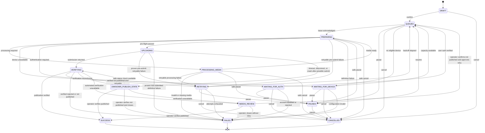

# Publish job state machine

Status: authoritative Phase 1 lifecycle

State changes occur only through the application transition service inside a database transaction. Routes, workers, queue adapters, and publisher adapters request transitions; they do not write `publish_jobs.status` directly.

## States

| State | Meaning |
| --- | --- |
| `DRAFT` | Valid publication intent not yet eligible for dispatch |
| `QUEUED` | Eligible for a worker at or after `available_at` |
| `PREPARING` | Worker acknowledged the offer and is validating the attempt |
| `PROCESSING_MEDIA` | Required media preparation is running |
| `WAITING_FOR_DEVICE` | No compatible healthy device is currently available |
| `WAITING_FOR_AUTH` | Legitimate user authentication or security interaction is required |
| `UPLOADING` | Publisher submission has begun; external side effect may occur |
| `VERIFYING` | Submission completed or may have completed; result is being checked |
| `SUCCESS` | Publication was verified successful |
| `RETRYING` | Retryable failure has a persisted future `available_at` |
| `PAUSED` | Operator/project policy suspended execution before unsafe side effects |
| `CANCELLED` | Publication intent was safely cancelled before publication was possible |
| `FAILED` | Definitive non-success with no automatic work remaining |
| `UNKNOWN_PUBLISH_STATE` | Publication may have occurred and must not be resubmitted blindly |
| `NEEDS_REVIEW` | Automated recovery cannot safely determine the next action |

`SUCCESS`, `CANCELLED`, and `FAILED` are terminal. Terminal records are immutable except for annotations and audit-safe retention metadata.

## Diagram



## Allowed-transition table

Only the following direct transitions are valid:

| From | To |
| --- | --- |
| `DRAFT` | `QUEUED`, `CANCELLED` |
| `QUEUED` | `PREPARING`, `WAITING_FOR_DEVICE`, `PAUSED`, `CANCELLED` |
| `PREPARING` | `PROCESSING_MEDIA`, `WAITING_FOR_DEVICE`, `WAITING_FOR_AUTH`, `UPLOADING`, `RETRYING`, `PAUSED`, `CANCELLED`, `FAILED` |
| `PROCESSING_MEDIA` | `PREPARING`, `RETRYING`, `PAUSED`, `CANCELLED`, `FAILED` |
| `WAITING_FOR_DEVICE` | `QUEUED`, `PAUSED`, `CANCELLED`, `FAILED` |
| `WAITING_FOR_AUTH` | `QUEUED`, `PAUSED`, `CANCELLED`, `FAILED` |
| `UPLOADING` | `VERIFYING`, `RETRYING`, `FAILED`, `UNKNOWN_PUBLISH_STATE` |
| `VERIFYING` | `SUCCESS`, `RETRYING`, `FAILED`, `UNKNOWN_PUBLISH_STATE`, `NEEDS_REVIEW` |
| `RETRYING` | `QUEUED`, `PAUSED`, `CANCELLED`, `FAILED` |
| `PAUSED` | `QUEUED`, `CANCELLED` |
| `UNKNOWN_PUBLISH_STATE` | `VERIFYING`, `SUCCESS`, `FAILED`, `NEEDS_REVIEW` |
| `NEEDS_REVIEW` | `QUEUED`, `SUCCESS`, `FAILED` |
| `SUCCESS`, `CANCELLED`, `FAILED` | none |

Every transition declares an actor, reason code, expected current `version`, and optional attempt. The transaction updates the job with `WHERE id = ? AND workspace_id = ? AND status = ? AND version = ?`, appends `job_events`, updates attempt/result when applicable, and writes an outbox event. Zero updated rows means conflict, not success.

## Forbidden-transition principles

- No state can transition directly to `SUCCESS` without a verified result or audited manual verification.
- `UPLOADING` cannot transition to `QUEUED`, `PAUSED`, or `CANCELLED` merely because a lease expired.
- `UNKNOWN_PUBLISH_STATE` and `NEEDS_REVIEW` cannot enter `QUEUED` automatically.
- Terminal states cannot be reopened.
- A retry cannot create a second attempt until the previous attempt has a definitive ended or uncertain state.
- Queue and lease expiry never bypass transition guards.

## Attempt lifecycle

An attempt is created when an offered job lease is acknowledged and the job moves from `QUEUED` to `PREPARING`. `attempt_number` is allocated under the job row lock and `attempt_count` increments in the same transaction. One attempt may pass through preparation, media processing, upload, and verification states.

Returning `RETRYING -> QUEUED` does not create an attempt. The next acknowledged offer does. Attempts exhausted transitions `RETRYING -> FAILED` without another offer.

## Retry behavior

Automatic retry requires all of:

1. the error category is `RETRYABLE`;
2. `publishMayHaveOccurred=false`;
3. `attempt_count < max_attempts`;
4. the account/project/workspace circuit and rate policies permit it;
5. a persisted backoff produces a future `available_at`.

Default backoff is configured per project, initially 1, 5, 15, and 30 minutes with bounded jitter generated once and persisted. Tests inject the resulting value; they do not depend on randomness. Errors classified `NON_RETRYABLE` enter `FAILED` or a waiting state when human authentication is appropriate. `MANUAL_REVIEW_REQUIRED` enters `UNKNOWN_PUBLISH_STATE` or `NEEDS_REVIEW`.

## Cancellation and pause

Cancellation is immediate only before `UPLOADING`. During `UPLOADING` or `VERIFYING`, the API records `cancel_requested_at` and returns `CANCELLATION_PENDING`; it does not change state. If the adapter explicitly supports `CANCEL`, the worker may request it, then verifies the outcome. An uncertain cancellation still enters `UNKNOWN_PUBLISH_STATE`.

Pause has the same safe-point rule. A project pause prevents new offers and transitions queued/waiting/retrying jobs to `PAUSED`; active preparation stops only at a pre-upload safe point. It never interrupts an unknown external side effect.

## Crash and stale-lease recovery

The recovery loop locks each expired lease and corresponding job:

- offer expired before acknowledgment: expire leases; job remains `QUEUED`;
- crash in `PREPARING` or `PROCESSING_MEDIA`: end attempt with `WORKER_OFFLINE`; transition to `RETRYING` if allowed, otherwise `FAILED`;
- crash in `WAITING_FOR_DEVICE`/`WAITING_FOR_AUTH`: release leases and retain or pause the waiting state according to policy;
- crash in `UPLOADING`: transition to `UNKNOWN_PUBLISH_STATE` unconditionally;
- crash in `VERIFYING`: transition to `UNKNOWN_PUBLISH_STATE`, then perform only a supported read-only status check;
- terminal job with stale lease: expire lease without changing job.

Recovery is idempotent and guarded by job/lease versions. It appends one event per recovery operation using a unique recovery operation ID.

## Manual review resolution

Only users with `jobs.resolve_review` may resolve unknown/review states. The UI requires evidence and one of these explicit decisions:

- `CONFIRMED_PUBLISHED` -> `SUCCESS`;
- `CONFIRMED_NOT_PUBLISHED_CLOSE` -> `FAILED`;
- `CONFIRMED_NOT_PUBLISHED_RETRY` -> `QUEUED` from `NEEDS_REVIEW` only.

For `UNKNOWN_PUBLISH_STATE`, a retry decision first records the evidence and transitions to `NEEDS_REVIEW`; a second confirmation performs the retry transition. This deliberate two-step boundary prevents a single accidental resubmission. All resolutions are audited.

## Idempotency

### Canonical key

Each publication intent has a stable execution slot. Scheduled work uses `schedule_run.id`; immediate work creates `execution_slot_id` once when the operator confirms the batch. Retries reuse the same slot and job.

The canonical UTF-8 string is:

```text
otshop-publish-v1\n
workspace_id=<uuid>\n
account_id=<uuid>\n
media_asset_id=<uuid>\n
project_id=<uuid>\n
project_item_id=<uuid>\n
execution_slot_id=<uuid>
```

UUIDs are lowercase canonical strings; keys are ordered exactly as shown; no display names, captions, timestamps, or mutable metadata participate. `idempotency_key` is the lowercase hexadecimal SHA-256 digest of those bytes.

### Database enforcement and behavior

The unique constraint is `(workspace_id, idempotency_key)`.

| Situation | Behavior |
| --- | --- |
| Duplicate draft/queued/active request | Return the existing job ID and current status; do not insert or enqueue again |
| Duplicate successful request | Return `DUPLICATE_JOB` with existing successful job/result reference; no publisher call |
| Retryable failure before possible submit | Reuse the same job and idempotency key; create a later attempt only |
| Network failure after possible submit | Enter `UNKNOWN_PUBLISH_STATE`; never create or enqueue a replacement |
| Concurrent batch creators | `INSERT ... ON CONFLICT` returns the winner's job under the unique constraint |
| Intentional later republication | Requires a new explicit execution slot and normal operator confirmation |

Adapters must check for an existing local `SUCCESS` before every publish call inside the job transaction boundary. A downstream system that supports an official idempotency field may also receive this key, but local safety never depends on that capability.
