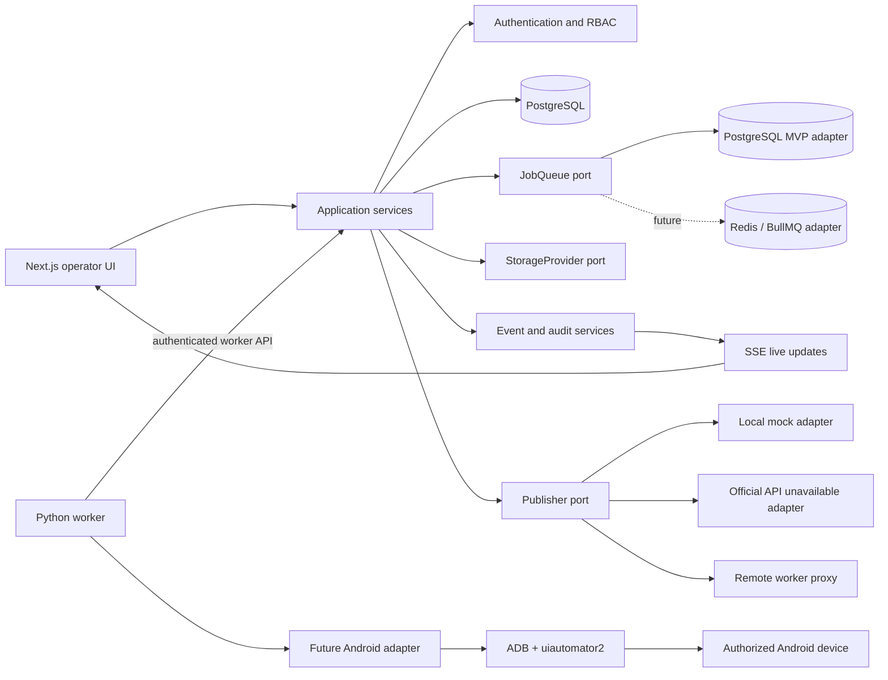
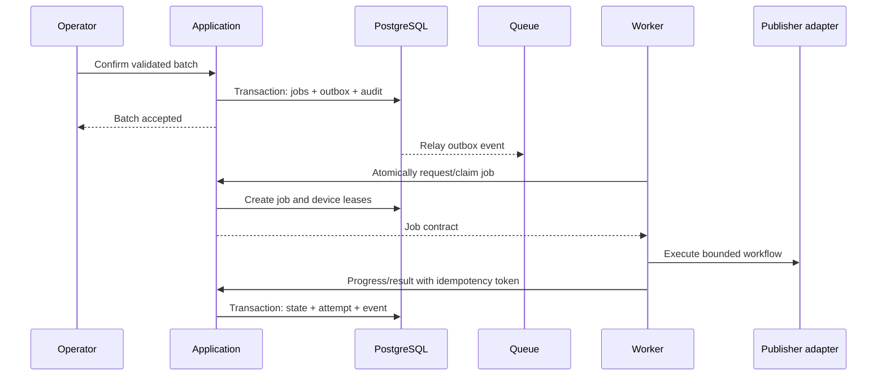

# Proposed architecture

Status: Phase 0 proposal retained for decision history. The authoritative Phase 1 design is [MVP system design](system-design.md) and its linked documents.

## Recommended shape

Use a modular monolith for the control plane and a separately deployed Python worker. This keeps the first deployment understandable while preserving hard boundaries around publishing, queueing, storage, and Android automation.

## Control-plane boundaries

- **Presentation:** Next.js pages and server-rendered/operator UI. It never makes authorization decisions by itself.
- **Application:** use cases for workspaces, datasets, projects, scheduling, job creation, worker coordination, reports, and audits.
- **Domain:** framework-independent state machines, policies, typed IDs, error taxonomy, publisher ports, queue ports, and storage ports.
- **Infrastructure:** Prisma/PostgreSQL with the initial PostgreSQL queue adapter, local/S3-compatible storage, observability, and external adapters. BullMQ/Redis is a future optional adapter.
- **Worker gateway:** versioned authenticated endpoints for registration, heartbeat, job lease, progress, results, and sanitized diagnostics.

Routes and chat/CLI integrations should call application services; they must not duplicate publishing logic.

## Source of truth and delivery semantics

PostgreSQL is the source of truth for jobs, leases, attempts, events, and audit records. Queue delivery is an optimization and wake-up mechanism, not the canonical job state. Job creation and an outbox event should commit atomically. Consumers must be idempotent.

Workers claim a job through an atomic database operation with a lease. A device lease is independent but correlated with the job lease. Heartbeats renew both within bounded limits. Expired leases trigger recovery; a crash during `UPLOADING` transitions to an unknown publication state requiring verification, not blind retry.

## Tenant and authorization model

All tenant-owned records carry `workspace_id`; organization membership alone does not grant resource access. Application queries require a request-scoped actor and workspace context. Server-side permission checks precede data access. Database constraints enforce foreign-key and uniqueness invariants; integration tests prove cross-workspace isolation.

Initial roles map to explicit permissions rather than role-name checks. `SUPER_ADMIN` is system-scoped and highly audited. The remaining roles receive workspace-scoped grants.

## Publisher boundary

The generic application port is `Publisher`; a Shopee specialization may add verified capabilities without leaking Android details into domain services. Initial adapters are:

- `MockPublisher`: deterministic scenarios for the complete control-plane workflow;
- `ShopeeOfficialApiPublisher`: returns `FEATURE_NOT_AVAILABLE` until an official, region-appropriate video-publishing capability is documented and authorized;
- `ShopeeAndroidPublisher`: remains behind feature flags and delegates navigation to versioned Screen Objects.

No official endpoint, request schema, private authentication flow, package identifier, or selector is proposed here.

## Safety defaults

- `ENABLE_REAL_PUBLISH=false` and `ALLOW_REAL_PUBLISH=false` by default.
- A separate explicit confirmation and deployment configuration are required for a controlled real publish.
- CAPTCHA, OTP, login, and security challenges transition to human-interaction states.
- Account identity mismatch halts the workflow.
- One active UI job per Android device.
- Large batches require an operator-visible destination summary and confirmation.
- Logs and diagnostics are redacted at collection and checked again at export.

## Initial technology choices

| Concern | Proposal | Reason |
| --- | --- | --- |
| Web/control plane | Next.js, strict TypeScript, React, Tailwind, shadcn/ui | Matches the preferred stack and supports one deployable modular application |
| Runtime validation | Zod-compatible schemas in shared contracts | Network and environment inputs require runtime validation |
| Database | PostgreSQL with Prisma migrations | Relational integrity, transactions, typed access, mature locking |
| Queue | `JobQueue` port; PostgreSQL adapter for MVP, optional future BullMQ/Redis adapter | Keeps business logic independent without a mandatory Redis dependency |
| Live updates | Server-Sent Events initially | Dashboard traffic is primarily server-to-client; simpler than bidirectional sockets |
| Storage | Local adapter for development; S3-compatible adapter for deployment | Allows incremental start without locking domain logic to disk paths |
| Worker | Python with type checking, Pydantic, ADB, uiautomator2 | Appropriate ecosystem for Windows-first Android automation |
| Testing | Unit, property/state-machine, integration, API, database, and mock-worker suites | Covers the concurrency and isolation risks before device work |

## Phase 1 resolutions

- MVP topology is one central control-plane host with PostgreSQL/local storage and outbound-only Windows workers; shared storage is required before horizontal web scaling.
- Authentication uses application-local Argon2id credentials and hashed database sessions, with a future identity-provider boundary.
- Redis is not required for MVP; PostgreSQL provides the initial queue.
- Worker enrollment uses a single-use token and a separately rotatable, hashed worker credential.
- Detailed SLO, retention, backup, and restore objectives remain Phase 12 deployment inputs; safe defaults and storage boundaries are defined now.
- Authorized Android UI evidence remains a mandatory Phase 7-8 prerequisite and is not part of Phase 2.
