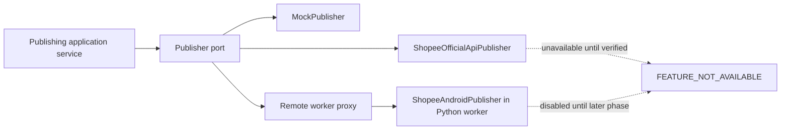

# Publisher contract

Status: authoritative port design; cross-boundary schemas implemented in Slice 2.2 and deterministic mock vertical slice implemented in Slice 2.6

## Boundary

Application services depend on a generic `Publisher` port. They do not know whether an adapter is mock, official, or Android based. Adapters receive a fully authorized, validated request and cannot query arbitrary tenant data.

The port describes behavior, not process location. `MockPublisher` and any future verified official API adapter execute locally in the control plane. The Android implementation executes in the Python worker and is represented to the control plane by a remote-worker proxy. Protocol serialization does not change the application-facing result and error semantics.



## Capabilities

```ts
export const publisherCapabilityNames = [
  "VIDEO_UPLOAD",
  "CAPTION",
  "PRODUCT_ATTACHMENT",
  "STATUS_CHECK",
  "CANCEL",
] as const;

export type PublisherCapability =
  (typeof publisherCapabilityNames)[number];

export type CapabilitySupport = "SUPPORTED" | "UNSUPPORTED";

export type PublisherCapabilities = Readonly<
  Record<PublisherCapability, CapabilitySupport>
>;
```

Capability parsing starts with all known keys set to `UNSUPPORTED`, then accepts only explicitly validated `SUPPORTED` values. Missing keys, unknown keys, malformed responses, unverified capabilities, and adapter errors never become supported by inference.

Capabilities are checked during project pre-flight and again immediately before execution. A project requiring an unsupported capability fails with `PUBLISHER_CAPABILITY_UNSUPPORTED`; adapters must not silently omit captions or product attachments.

## Contract types

```ts
export type PublisherKind =
  | "MOCK"
  | "SHOPEE_OFFICIAL_API"
  | "SHOPEE_ANDROID";

export type PublishRequest = Readonly<{
  requestId: string;
  idempotencyKey: string;
  workspaceId: string;
  jobId: string;
  attemptId: string;
  account: Readonly<{
    accountId: string;
    expectedDisplayName: string;
    countryCode: string;
  }>;
  media: Readonly<{
    assetId: string;
    storageKey: string;
    sha256Hex: string;
    mimeType: string;
    sizeBytes: number;
  }>;
  caption: string | null;
  products: ReadonlyArray<Readonly<{
    productReferenceId: string;
    displayName: string;
    operatorReference: string | null;
    productUrl: string | null;
  }>>;
  mode: "MOCK" | "DRY_RUN" | "REAL";
  deadlineAt: string;
}>;

export type PublishReceipt = Readonly<{
  disposition: "ACCEPTED" | "COMPLETED";
  externalReference: string | null;
  submittedAt: string | null;
  completedAt: string | null;
  sanitizedMetadata: Readonly<Record<string, string | number | boolean | null>>;
}>;

export type PublishStatus = Readonly<{
  state:
    | "PENDING"
    | "PUBLISHED"
    | "REJECTED"
    | "NOT_FOUND"
    | "UNKNOWN";
  externalReference: string;
  checkedAt: string;
  publishedAt: string | null;
  sanitizedMetadata: Readonly<Record<string, string | number | boolean | null>>;
}>;

export type PublishResult =
  | Readonly<{ ok: true; receipt: PublishReceipt }>
  | Readonly<{ ok: false; error: PublisherError }>;

export type PublisherError = Readonly<{
  code: string;
  category: "RETRYABLE" | "NON_RETRYABLE" | "MANUAL_REVIEW_REQUIRED";
  safeMessage: string;
  publishMayHaveOccurred: boolean;
  retryAfterSeconds: number | null;
  sanitizedDetails: Readonly<Record<string, string | number | boolean | null>>;
}>;

export type PublisherConnectionResult =
  | Readonly<{
      ok: true;
      capabilities: PublisherCapabilities;
      adapterVersion: string;
    }>
  | Readonly<{ ok: false; error: PublisherError }>;
```

`storageKey` is an opaque key resolved by an authorized media service or worker transfer mechanism; adapters never concatenate it into an unrestricted path. `deadlineAt` is a total operation deadline. Adapter-specific timeouts must fit inside it.

## Port operations

```ts
export interface Publisher {
  readonly kind: PublisherKind;

  validateConnection(): Promise<PublisherConnectionResult>;

  getCapabilities(): Promise<PublisherCapabilities>;

  publish(request: PublishRequest): Promise<PublishResult>;

  checkStatus(input: Readonly<{
    requestId: string;
    workspaceId: string;
    jobId: string;
    accountId: string;
    externalReference: string;
    deadlineAt: string;
  }>): Promise<PublishStatus>;

  cancel(input: Readonly<{
    requestId: string;
    workspaceId: string;
    jobId: string;
    externalReference: string;
    deadlineAt: string;
  }>): Promise<Readonly<{ cancelled: boolean }>>;
}
```

The interface always exposes `checkStatus` and `cancel` so callers remain adapter-independent, but callers may invoke them only when the capability is `SUPPORTED`. An adapter receiving an unsupported operation returns a non-retryable `PUBLISHER_CAPABILITY_UNSUPPORTED` error and performs no side effect.

## Adapter registry

The registry is an application-startup mapping from `PublisherKind` to safe descriptors and executable factories. Registration, feature enablement, availability, capability support, and real-publish permission are separate states:

| Adapter | Registration rule |
| --- | --- |
| `MockPublisher` | registered and available; execution accepts only `mode=MOCK` |
| `ShopeeOfficialApiPublisher` | descriptor is visible but unavailable; no adapter implementation or factory exists |
| `ShopeeAndroidPublisher` | descriptor is visible but unavailable; no adapter implementation or factory exists |

An unavailable or unknown kind returns `FEATURE_NOT_AVAILABLE` and never falls back to mock. Even hypothetical true feature flags do not make a real adapter available because no verified adapter exists. The official and Android descriptors report all capabilities unsupported and cannot perform connection validation, publication, status, network, worker, or device activity.

## Call semantics

- One `publish` call represents one attempt for one already-existing job.
- The application supplies the canonical idempotency key; an adapter passes it downstream only if the verified platform supports such a field.
- Adapters do not retry submission internally. They may retry demonstrably read-only connection/status operations within the total deadline.
- All adapter outputs are runtime validated.
- An exception is converted into a typed `PublisherError`; raw exceptions never determine state transitions directly.
- If a timeout, disconnect, or crash occurs after the point where publication might have been submitted, `publishMayHaveOccurred=true` and the job enters `UNKNOWN_PUBLISH_STATE`.
- Sanitized metadata is allowlisted per adapter and size limited. Raw provider responses are not stored by default.

## MockPublisher

The Slice 2.6 mock adapter is deterministic. It never uses probability, network access, external APIs, device activity, or wall-clock races to choose an outcome. The explicit scenario vocabulary is:

```ts
export type MockScenario =
  | "SUCCESS"
  | "RETRYABLE_FAILURE"
  | "NON_RETRYABLE_FAILURE"
  | "AUTH_REQUIRED"
  | "DEVICE_OFFLINE"
  | "UPLOAD_TIMEOUT"
  | "UNKNOWN_PUBLISH_STATE";
```

Rules:

- `SUCCESS` returns a normalized completed receipt.
- `RETRYABLE_FAILURE`, `DEVICE_OFFLINE`, and `UPLOAD_TIMEOUT` are retryable only because submission is proven not to have occurred.
- `NON_RETRYABLE_FAILURE` and `AUTH_REQUIRED` are non-retryable canonical errors.
- `UNKNOWN_PUBLISH_STATE` uses `MANUAL_REVIEW_REQUIRED`, `publishMayHaveOccurred=true`, and can never be retried automatically.
- The mock reference is a stable SHA-256-derived `mock:publication:` value based on the canonical idempotency key. The same canonical request produces the same receipt.
- Mock external references use a clearly synthetic `mock:` prefix and never resemble Shopee identifiers.
- Safe mock metadata is limited to scenario, request ID, and mock reference.

Mock controls are accepted only by the dedicated mock execution application use case, are runtime-schema validated, require `projects.run`, and are unavailable when `NODE_ENV=production`. They are never accepted for real adapter kinds.

## Slice 2.6 application boundary

The application service receives an already validated `AuthenticatedContext`, rechecks `projects.run`, rejects any request whose workspace differs from `AuthenticatedContext.workspaceId`, and overwrites the canonical request ID with the server correlation ID. Required capabilities are derived from request content: media requires `VIDEO_UPLOAD`, non-null caption requires `CAPTION`, and non-empty products require `PRODUCT_ATTACHMENT`. Client-supplied required-capability lists are rejected.

The minimal protected endpoints are `GET /api/publishers`, `POST /api/publishers/preflight`, and the non-production-only `POST /api/publishers/mock/execute`. They reuse the shared authentication, origin/CSRF, no-store, request-ID, structured logging, and safe error envelope boundaries. Slice 2.6 creates no `PublishJob`, lease, schedule, attempt, or external side effect.

## Product attachment rule

Product references are operator-maintained records. The existence of a URL or operator reference does not imply programmatic product-attachment support. Pre-flight permits products only when the selected adapter explicitly reports `PRODUCT_ATTACHMENT=SUPPORTED`. Multiple products additionally require an adapter-specific verified maximum recorded as sanitized capability metadata; absent a verified maximum, the MVP permits at most one.

## Error mapping

Adapters map observed failures to the centralized [error taxonomy](error-taxonomy.md). Unknown adapter responses become `UNKNOWN_ERROR` with `MANUAL_REVIEW_REQUIRED` when publication may have occurred, otherwise `NON_RETRYABLE` until classified. They never guess retryability from an HTTP status or UI text without an adapter-specific verified mapping.
