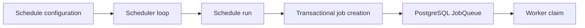

# Scheduler architecture

Status: authoritative Phase 1 scheduling design

## Boundary

The scheduler calculates occurrences and creates publication jobs. It never claims jobs, calls a publisher, communicates with Android, or changes a job to an execution state.

## Schedule kinds

- **Immediate:** the operator confirmation command creates an execution slot and jobs immediately; it does not require a `Schedule` row.
- **Once:** one local or absolute scheduled time produces one `ScheduleRun`.
- **Recurring:** an RFC 5545 RRULE subset, local start time, IANA timezone, and explicit daylight-saving policies generate runs incrementally.

Arbitrary cron strings are not exposed in the MVP UI. The supported recurrence subset is validated and documented alongside the chosen library in Phase 2.

## Time model

- Store instants as PostgreSQL `timestamptz` in UTC.
- Store each schedule's IANA timezone (for example, `Asia/Jakarta`) and original local start separately.
- Compute occurrences with an IANA timezone-aware library; never add 24 hours to model a local daily schedule.
- Persist `scheduled_for` UTC plus canonical `local_occurrence` so an occurrence remains explainable if timezone data changes.
- Display in the workspace timezone by default and label any user-selected override.

Daylight-saving behavior is explicit:

| Condition | MVP default | Configurable values |
| --- | --- | --- |
| Local time does not exist (spring gap) | `SKIP` | `SKIP`, `NEXT_VALID_TIME` |
| Local time occurs twice (fall overlap) | `EARLIER_OFFSET` | `EARLIER_OFFSET`, `LATER_OFFSET` |

`Asia/Jakarta` currently has no DST, but the architecture cannot assume all future workspaces share that property.

## Scheduler loop

When `ENABLE_SCHEDULER=true`, one or more scheduler processes execute this idempotent loop:

1. select due active schedules by `next_run_at <= database_now` with `FOR UPDATE SKIP LOCKED`;
2. recompute and validate the expected occurrence from persisted local rules;
3. insert `schedule_runs` using its unique occurrence constraint;
4. for a newly inserted run, build project jobs using the run ID as `execution_slot_id`;
5. insert jobs with their idempotency unique constraint and append job/outbox/audit events;
6. calculate and persist the next valid occurrence;
7. commit the run, jobs, outbox rows, and next occurrence together.

A conflicting schedule-run insert means another scheduler already generated it. The loser reloads state and performs no duplicate job creation.

## Missed occurrences and downtime

The schedule has a `misfire_policy`, finalized for the MVP as:

- `SKIP`: record skipped runs up to a bounded audit window and advance to the next future occurrence;
- `RUN_ONCE`: create only the most recent missed occurrence;
- `CATCH_UP_BOUNDED`: create oldest missed occurrences up to configured `max_catch_up_runs`.

The safe default is `RUN_ONCE` with maximum one catch-up run. The batch summary shows it as delayed. Scheduler startup never creates an unbounded backlog.

## Duplicate protection

Three layers apply:

1. unique schedule occurrence `(schedule_id, scheduled_for, local_occurrence)`;
2. stable job `execution_slot_id = schedule_run.id`;
3. unique `(workspace_id, publish_job.idempotency_key)`.

Editing a schedule increments its version and affects only ungenerated occurrences. Existing runs/jobs retain the rule snapshot needed for audit. Disabling a schedule stops new runs and does not silently cancel already-created jobs.

## Immediate jobs

The confirmed batch command generates one UUID `execution_slot_id` and uses it for all items in that batch; each item still has a distinct key because `project_item_id` and media differ. Retrying the HTTP request reuses a client idempotency token mapped to that execution slot. Intentionally starting the same project again creates a new slot after a new destination summary and confirmation.

## Required tests

- once schedule generates exactly one run under concurrent schedulers;
- recurring calculation preserves local wall time;
- spring gap and fall overlap honor configured policy;
- duplicate scheduler execution returns existing run/jobs;
- downtime policies are bounded;
- editing/disabling does not rewrite existing runs;
- scheduler disabled means no loop runs;
- scheduler code has no publisher or worker-device dependency.
