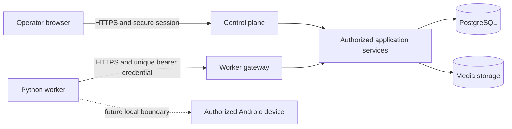

# Security architecture

Status: authoritative Phase 1 security model; application authentication and RBAC implemented in Phase 2 Slice 2.4

## Trust boundaries



Browsers and workers are untrusted clients. Authentication establishes identity; it does not establish permission. Application services authorize every operation and scope it to a workspace before database access.

## User authentication

The MVP uses application-local credentials only for OTShop users, never Shopee credentials:

- passwords are hashed with Argon2id using parameters stored in the encoded hash and reviewed during Phase 2;
- generic login errors do not reveal account existence;
- bounded per-IP and per-account throttling plus temporary lockout protect login;
- database-backed sessions use 256-bit random tokens; only SHA-256 token hashes are stored;
- session cookies are `HttpOnly`, `Secure` outside loopback, `SameSite=Lax`, path `/`, and have no domain override;
- state-changing browser requests require same-origin validation and CSRF protection where cookie semantics do not already provide it;
- session rotation occurs at login, password change, and privilege change;
- suspension, password change, and explicit logout revoke applicable sessions.

The first `SUPER_ADMIN` is created by an explicit one-time bootstrap command that refuses to run after a super administrator exists. Later identity-provider support must map a verified issuer and subject to a user identity; it must not weaken workspace authorization.

### Slice 2.4 implementation

- `argon2` `0.44.0` hashes passwords with Argon2id, 64 MiB memory, three iterations, parallelism one, and a 32-byte hash. Encoded parameters support `needsRehash` upgrades.
- Login identifiers are trimmed, lowercased email addresses; PostgreSQL `citext` supplies matching case-insensitive uniqueness.
- Browser sessions use a random 256-bit base64url token. Only its SHA-256 digest is stored in `user_sessions`; the raw token exists only in the HttpOnly cookie and request memory.
- Sessions expire after eight hours. Login creates a fresh session; workspace selection rotates it transactionally and revokes the old session. Logout and explicit revocation update `revoked_at` before clearing cookies.
- The cookie is `HttpOnly`, `SameSite=Lax`, path `/`, bounded by the database expiry, and `Secure` in production or on any non-loopback host. A second HttpOnly cookie carries only a requested workspace UUID; it is never trusted without a fresh membership lookup.
- Every cookie-authenticated mutation requires an `Origin` exactly matching configured `APP_URL`. SameSite is defense in depth; origin validation is the implemented CSRF boundary.
- Five failed known-account attempts set a 15-minute database lock. An in-process limiter permits at most five failures per hashed email/IP-prefix key per minute, including unknown accounts. This is intentionally single-process; distributed rate limiting is deferred and must be added before horizontally scaled deployment.
- Unknown email, wrong password, inactive user, lockout, and local throttling return the same credential error. Internal audits record only a categorized reason and identifiers, never the submitted email/password or token.
- Workspace-admin session revocation validates that the target has an active membership in the actor's validated workspace before changing any session; an arbitrary user UUID from another workspace is denied and audited.

The minimum Slice 2.4 text lifecycle contract is closed at the application boundary: organizations and workspaces accept `ACTIVE` or `SUSPENDED`; memberships accept `ACTIVE`, `SUSPENDED`, or `REVOKED`. Only exact `ACTIVE` organization, workspace, membership, and user states authorize access. Unknown text fails closed.

The one-time local bootstrap command has no HTTP endpoint and no default credential. On Windows, follow the root README procedure; the password is supplied through a temporary process environment variable, hashed normally, and cleared immediately. The serializable transaction creates user, credential, `SUPER_ADMIN` grant, and `SUPER_ADMIN_BOOTSTRAPPED` audit together.

The canonical Slice 2.4 audit actions are `AUTH_LOGIN_SUCCESS`, `AUTH_LOGIN_FAILURE`, `AUTH_LOGOUT`, `SESSION_REVOKED`, `SUPER_ADMIN_BOOTSTRAPPED`, `WORKSPACE_SELECTED`, and `AUTHORIZATION_DENIED`.

## Tenant isolation rule

The hierarchy is exact:

```text
Organization
  -> Workspace
     -> Members
     -> Accounts
     -> Workers and devices
     -> Media and datasets
     -> Projects and schedules
     -> Jobs, attempts, results, and events
```

For every tenant operation:

1. The route obtains the authenticated actor.
2. The requested `workspace_id` is explicit; no implicit "current workspace" is trusted from a cookie alone.
3. The authorization service loads active membership by `(user_id, workspace_id)` and checks a named permission.
4. The repository method requires `workspace_id` as a non-optional argument.
5. Every query includes `workspace_id`; child lookups use `(workspace_id, id)`.
6. Composite database foreign keys reject cross-workspace references.
7. The audit record carries the same workspace and actor.

Only a user with the system-scoped `SUPER_ADMIN` role may cross workspace boundaries. It uses dedicated system-administration use cases, never an omitted workspace predicate. Every cross-workspace read or mutation is audit logged with a reason. Worker credentials are bound to exactly one workspace.

## Permission matrix

Legend: `Y` allowed, `O` own/create within assigned workspace, `R` read only, `-` denied. `SUPER_ADMIN` actions use dedicated system scope.

| Permission code | SUPER_ADMIN | ADMIN | SUPERVISOR | OPERATOR | VIEWER |
| --- | :---: | :---: | :---: | :---: | :---: |
| `system.manage` | Y | - | - | - | - |
| `workspace.read` | Y | Y | Y | Y | R |
| `workspace.manage` | Y | Y | - | - | - |
| `members.read` | Y | Y | Y | - | - |
| `members.manage` | Y | Y | - | - | - |
| `accounts.read` | Y | Y | Y | Y | R |
| `accounts.manage` | Y | Y | - | - | - |
| `workers.read` | Y | Y | Y | Y | R |
| `workers.manage` | Y | Y | - | - | - |
| `devices.read` | Y | Y | Y | Y | R |
| `devices.manage` | Y | Y | - | - | - |
| `datasets.read` | Y | Y | Y | Y | R |
| `datasets.write` | Y | Y | Y | O | - |
| `media.upload` | Y | Y | Y | O | - |
| `media.delete` | Y | Y | Y | - | - |
| `projects.read` | Y | Y | Y | Y | R |
| `projects.write` | Y | Y | Y | O | - |
| `projects.run` | Y | Y | Y | O | - |
| `projects.pause_resume` | Y | Y | Y | O | - |
| `jobs.read` | Y | Y | Y | Y | R |
| `jobs.create` | Y | Y | Y | O | - |
| `jobs.cancel` | Y | Y | Y | O | - |
| `jobs.retry` | Y | Y | Y | O | - |
| `jobs.resolve_review` | Y | Y | Y | - | - |
| `schedules.read` | Y | Y | Y | Y | R |
| `schedules.manage` | Y | Y | Y | - | - |
| `reports.read` | Y | Y | Y | Y | R |
| `reports.export` | Y | Y | Y | - | - |
| `audit.read` | Y | Y | Y | - | - |
| `settings.manage` | Y | Y | - | - | - |

`O` is still workspace-scoped. Phase 2 may initially treat an operator's own resources as those with `created_by_user_id = actor.id`; it must not silently grant mutation of another operator's draft. Supervisors and above may manage all workspace resources covered by their permission.

Role-to-permission mappings are migration-seeded. Authorization checks permission codes, not role names. Role changes invalidate active authorization caches and sessions are rotated.

## Worker authentication

- An administrator creates a single-use enrollment token with workspace, creator, and short expiry.
- The control plane stores only its hash. Successful registration consumes it atomically.
- Registration returns one random worker credential once; the database stores only its hash.
- Every worker request uses TLS and `Authorization: Bearer`; authorization headers are redacted before logging.
- Credentials identify one worker and workspace, can expire, rotate, and be revoked independently.
- A worker cannot choose another workspace in request payloads. The server derives workspace from the credential and rejects mismatches.
- Job and device lease tokens are separate random capabilities, stored hashed, short lived, scoped to one job/worker/device, and insufficient to access unrelated endpoints.
- Registration, rotation, revocation, repeated failures, and clock-skew violations are audited.

mTLS may be added for higher-assurance deployments but is not required to make Phase 2 runnable. Plain HTTP is permitted only on loopback development, never across an office network.

## Secret management

`.env` is local and ignored. Production secrets are injected through the deployment environment or an approved secret manager. Startup validation distinguishes public configuration from secrets and never prints secret values. Secret rotation has overlap for worker credentials but not for one-time enrollment tokens.

The following must never be stored or logged:

- Shopee passwords;
- OTP values;
- session cookies or private Shopee session material;
- authentication tokens;
- authorization headers;
- raw worker credentials;
- application plaintext passwords.

If a future verified official integration requires token storage, it requires a new threat model, envelope encryption with an external key, minimal scopes, rotation/revocation, and a documented official source before implementation.

## Audit logging

Audit records are append-only and cover login security events, membership/role changes, account/device binding, project and schedule mutations, batch confirmation, job cancellation/retry/manual resolution, worker enrollment/revocation, settings and feature-flag changes, diagnostic exports, and super-admin cross-workspace access.

Before/after fields use allowlisted safe fields. Captions, filenames, tokens, raw headers, UI hierarchies, and screenshots are not copied into audit JSON. Audit write failure causes the associated sensitive mutation to fail in the same transaction.

## File and media security

- Validate maximum size before accepting the body where possible.
- Verify extension, declared MIME, magic bytes, and actual FFprobe readability independently.
- Generate opaque storage keys; never use a user filename as a path.
- Resolve and verify local paths remain under the configured storage root.
- Store originals immutably and process into separate keys.
- Serve downloads through authorized handlers or short-lived signed URLs, never direct filesystem paths.
- Apply decompression/process timeouts and bounded CPU, memory, disk, and subprocess concurrency.
- Sanitize display filenames and response headers.

Malware scanning and production upload limits are deployment decisions that must be set before Phase 3; absence of a scanner must be visible in readiness/configuration, not silently assumed safe.

## Safe diagnostics

Diagnostics collection is opt-in per error or explicit admin request. The worker captures only the minimum necessary screen region and UI hierarchy. Before upload and again before export, it removes known token patterns, authorization headers, cookies, OTP-like fields, and configured sensitive UI nodes. Bundles have opaque keys, workspace-scoped access, short retention, download audits, and no public URLs.

Screenshots may still contain personal information that automated redaction misses. The UI warns administrators and requires confirmation before download. Normal operator views never display raw ADB output, stack traces, or UI XML.

## Application security controls

- Runtime-schema validation at every HTTP, environment, queue, and publisher boundary.
- Parameterized database access through the database package; raw SQL is reviewed and isolated.
- Output encoding and a restrictive Content Security Policy for browser content.
- Same-origin and CSRF controls for cookie-authenticated mutations.
- Separate rate limits for login, enrollment, worker API, uploads, and operator mutations.
- Correlation IDs generated or sanitized at ingress; client-provided IDs are never trusted as authorization.
- Browser responses set `nosniff`, strict referrer policy, denied framing, a restrictive permissions policy, and a static CSP with `frame-ancestors 'none'`, `object-src 'none'`, and same-origin defaults. Nonce/SRI hardening and HSTS remain deployment work because HTTPS termination is not yet defined.
- Login, dashboard, workspace, authentication API, and readiness responses are private/no-store as applicable. Immutable hashed Next.js assets retain framework-managed caching.
- Dependency lockfiles and vulnerability scanning begin in Phase 2 CI.
- Error responses expose stable codes and safe messages, never stack traces or SQL details.

## Required Phase 2 security tests

- cross-workspace read and mutation denial for every repository family;
- composite-FK rejection of cross-workspace relationships;
- permission matrix allow/deny tests;
- suspended member and revoked-session rejection;
- worker workspace spoofing and revoked-credential rejection;
- CSRF and origin rejection for browser mutations;
- secret/log redaction tests;
- path traversal and unsafe filename tests for the storage skeleton;
- super-admin access audit enforcement.
