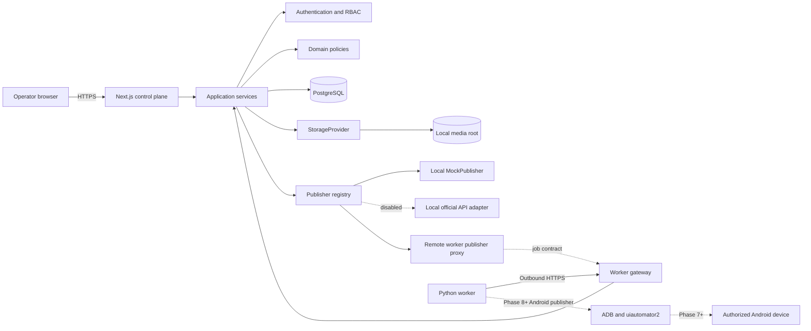
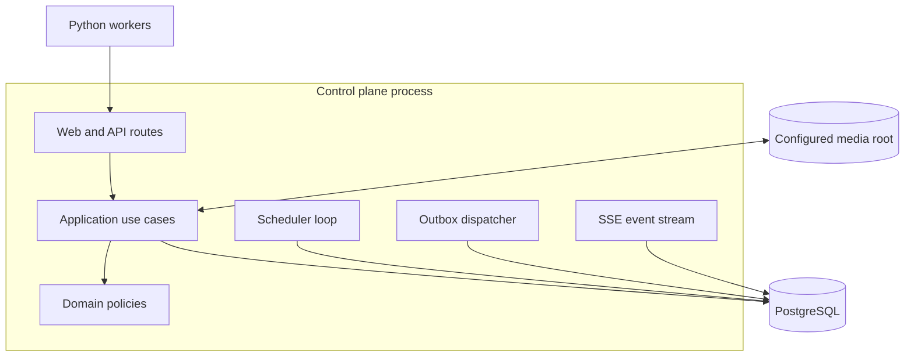
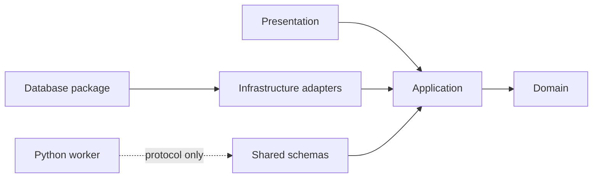

# MVP system design

Status: authoritative Phase 1 architecture

Scope: foundation through mock publishing; Android automation is explicitly out of scope

## Architectural decisions

The MVP is a modular monolith control plane plus a separately deployed Python worker:

- the control plane is one Next.js application using strict TypeScript;
- PostgreSQL is the system of record and the initial queue implementation;
- Redis is optional future infrastructure, not an MVP dependency;
- workers initiate outbound HTTPS requests to the control plane;
- media is accessed through a `StorageProvider`, initially local filesystem storage;
- publisher behavior is accessed only through the generic `Publisher` contract;
- the mock publisher is the only operational publisher through Phase 2;
- Android and official-API publishers remain unavailable behind conservative feature flags.



## Repository topology and ownership

```text
apps/
  web/
    app/                    Next.js routes and pages
    src/
      application/         Use cases and transaction orchestration
      domain/              Policies and ports, no framework imports
      infrastructure/      Adapter implementations
      presentation/        View models and UI components
      worker-gateway/      Versioned worker HTTP handlers
  worker/
    app/
      api/                  Control-plane client only
      models/               Pydantic protocol models
      services/             Heartbeat and job runner orchestration
      jobs/                 Lease-aware execution
      adb/                  Reserved until Phase 7
      automation/           Reserved until Phase 8
    tests/
packages/
  database/
    prisma/                 Schema and committed migrations
    src/                    Generated-client boundary and transaction helpers
  shared/
    src/                    TypeScript contracts, schemas, enums, error codes
  config/                   Shared TypeScript, lint, formatting, and test config
docs/
  architecture/             Authoritative design documents
  research/                 Evidence, not executable selectors
scripts/                    Explicit setup and operational scripts
```

| Boundary | Owns | Must not own |
| --- | --- | --- |
| `apps/web` presentation | HTTP/UI adaptation, accessible operator views | domain rules, raw database calls in components |
| `apps/web` application | use-case orchestration, authorization calls, transactions | Android selectors, framework-specific UI state |
| `apps/web` domain | state machine, permissions, idempotency, publisher/queue/storage ports | Prisma, Next.js, ADB, network clients |
| `packages/database` | Prisma schema, migrations, database client boundary | business decisions, HTTP handlers |
| `packages/shared` | stable TypeScript wire/domain schemas and error codes | database client, secrets, environment-specific logic |
| `apps/worker` | protocol client, heartbeats, bounded execution, future device control | tenant authorization, scheduling, job creation |
| publisher adapters | external-system translation behind capabilities | job orchestration or cross-tenant queries |
| queue adapter | availability, atomic offer/lease mechanics | publish behavior or scheduler policy |
| storage adapter | safe object naming, read/write/delete primitives | dataset authorization or retention decisions |

Python protocol models are generated from or contract-tested against an exported OpenAPI/JSON Schema artifact. Python does not import the TypeScript package directly.

Publisher execution location is an infrastructure detail. `MockPublisher` and any future verified official HTTP adapter run in the control plane. `ShopeeAndroidPublisher` runs inside the Python worker; the control plane represents it through a remote-worker proxy that obeys the same publisher result/error contract. Domain and application services never import the worker or ADB implementation.

## Runtime components



The scheduler and outbox dispatcher may run in the same deployable artifact but have separate process entry points and leader leases. Running multiple replicas is safe because PostgreSQL row locks and persisted leases serialize work.

## Request and event flow

1. A user authenticates and selects a workspace.
2. The route resolves an actor plus `workspace_id`; the application service checks permission before querying business data.
3. Batch creation validates the project and writes jobs, job events, audit data, and outbox rows in one transaction.
4. The PostgreSQL queue exposes eligible jobs to authenticated workers using atomic offers.
5. A worker acknowledges an offer, activating job and device leases and transitioning the job to `PREPARING`.
6. The worker reports progress with an idempotent report ID and current lease token.
7. Application services validate transitions and write attempt, result, event, and outbox changes transactionally.
8. Browser dashboards receive sanitized event summaries through SSE; PostgreSQL records remain authoritative.

```mermaid
sequenceDiagram
    participant U as Operator
    participant C as Control plane
    participant P as PostgreSQL
    participant W as Worker
    participant R as Publisher

    U->>C: Create or confirm batch
    C->>P: Transaction: jobs, events, audit, outbox
    C-->>U: Existing or created jobs
    W->>C: Claim request
    C->>P: Lock candidate; create offered leases
    C-->>W: Offer and ack deadline
    W->>C: Acknowledge offer
    C->>P: Activate leases; QUEUED to PREPARING
    W->>R: Execute typed publish request
    W->>C: Idempotent progress or result
    C->>P: Validate transition and commit result/event
```

## Deployment topology

The MVP supports a central control-plane host and one or more Windows worker computers on an office or VPN network. The control plane requires PostgreSQL and a configured media root. Workers require only Python during Phase 2; ADB is introduced later.

- Browser and worker traffic uses HTTPS outside loopback development.
- Workers initiate connections; the control plane does not require inbound access to worker machines.
- PostgreSQL is not exposed to workers or browsers.
- Local storage is valid for a single control-plane host. Horizontal web scaling requires shared S3-compatible storage before it is enabled.
- Redis is not installed or assumed for the MVP.

## Module dependency rule

Dependencies point inward:



The domain cannot import Next.js, Prisma, BullMQ, ADB, uiautomator2, or storage SDKs. Infrastructure adapters implement ports declared by the application/domain boundary.

## Queue, scheduling, and leases

- Queue semantics are specified in [Job queue](job-queue.md).
- Scheduler semantics are specified in [Scheduler](scheduler.md).
- Job transitions are specified in [Job state machine](job-state-machine.md).
- Worker and device leases are specified in [Worker protocol](worker-protocol.md).

All timestamps are stored as `timestamptz` in UTC. Workspace IANA timezones are preserved for display and recurring-schedule calculation.

## Media and storage boundary

`StorageProvider` exposes `put`, `openRead`, `stat`, `copy`, and policy-authorized `delete` operations using opaque storage keys. It never accepts a user-supplied filesystem path as the final key. The local adapter enforces a configured root and verifies resolved paths remain inside it.

Logical prefixes are `original/`, `processed/`, `thumbnails/`, `temporary/`, and `diagnostics/`. Original media is immutable. Retention decisions live in application policy, not the adapter. Upload validation and FFmpeg processing begin in Phase 3, not Phase 2.

## Observability

Application logs are structured JSON. The Next.js proxy replaces every browser-supplied correlation value with a server-generated UUIDv7, injects it internally as `x-otshop-request-id`, and returns the safe value as `x-request-id`. Direct route tests or internal calls generate a replacement if the trusted internal header is absent or malformed. Request IDs correlate activity; they never authenticate or authorize it.

The shared API wrapper records safe method, route, status, and duration fields. Authenticated services may add user and validated workspace IDs to server logs where useful, but must never add raw request bodies. The recursive sanitizer redacts normalized sensitive key variants such as passwords, passphrases, tokens, authorization, cookies, sessions, secrets, API keys, and database URLs at every nesting level while preserving ordinary operational fields.

Unknown exceptions are converted to the shared safe error envelope with a stable code, safe message, and request ID. Server logs retain correlation, route, status, mapped code, and exception type; exception messages, stacks, SQL, Prisma details, paths, connection strings, and secret metadata never cross the client boundary.

Debugging flow:

```text
User reports safe Request ID
  -> search structured logs by requestId
  -> confirm route/status and authorized workspace/user context
  -> correlate audit records by the same request ID where applicable
  -> diagnose without requesting credentials, cookies, tokens, or connection strings
```

Metrics and logs must not use unbounded media filenames, captions, or UI text as labels.

MVP health endpoints:

- `/health` reports process liveness without dependencies;
- `/ready` reports required configuration and database connectivity;
- worker heartbeat health is a domain status, not part of web-process liveness.

Both endpoint responses are `no-store`. Health never calls PostgreSQL. Readiness returns only `ready` or `unavailable` and HTTP 503 for missing configuration, a false probe, or a thrown probe; it never includes connection details.

## Feature flags

Flags are validated at process startup. Missing flags take the conservative value shown below; an invalid boolean fails startup.

| Flag | Development default | Production default | Rule |
| --- | --- | --- | --- |
| `ENABLE_SHOPEE_ANDROID` | `false` | `false` | Adapter is not registered when false |
| `ENABLE_SHOPEE_OFFICIAL_API` | `false` | `false` | Cannot be true without a documented capability record |
| `ENABLE_REAL_PUBLISH` | `false` | `false` | Must remain false through Phase 9 |
| `ENABLE_SCHEDULER` | `false` | `false` | Scheduler loop remains inactive when false |
| `ENABLE_WORKER_PROTOCOL` | `false` | `false` | Worker HTTP surface is not registered when false |
| `ALLOW_REAL_PUBLISH` | `false` | `false` | Worker-side independent kill switch |

Real publishing requires both control-plane and worker switches, an eligible adapter, verified capability, and operator confirmation. No single flag bypasses those checks.

## Architectural constraint register

| Requirement | Authoritative home |
| --- | --- |
| Domain entities and integrity | [Database](database.md) |
| Workspace isolation and RBAC | [Security](security.md) |
| Publisher capabilities and mock behavior | [Publisher contract](publisher-contract.md) |
| Job transitions, retries, cancellation, recovery | [Job state machine](job-state-machine.md) |
| Idempotency | [Job state machine](job-state-machine.md#idempotency) and [Database](database.md) |
| Worker API and leases | [Worker protocol](worker-protocol.md) |
| PostgreSQL queue and fairness | [Job queue](job-queue.md) |
| Immediate and recurring schedules | [Scheduler](scheduler.md) |
| Error categories | [Error taxonomy](error-taxonomy.md) |
| Phase 2 deliverables | [Phase 2 contract](phase-2-plan.md) |

## Explicitly deferred

Phase 1 does not define or implement Shopee endpoints, authentication methods, Android package names, activities, selectors, coordinate taps, final publish actions, or platform limits. Those require verified official documentation or authorized UI evidence in later gated phases.
