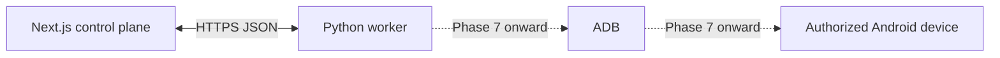

# Worker protocol and leases

Status: authoritative Phase 1 protocol

Transport: versioned JSON over HTTPS; worker-initiated only

## Topology



The worker is a separate application and trust principal. It does not connect to PostgreSQL, create jobs, evaluate user RBAC, or perform scheduling. It receives only work authorized and leased by the control plane.

## Protocol conventions

- Base path: `/api/worker/v1`.
- JSON uses camelCase; timestamps are RFC 3339 UTC strings with `Z`.
- IDs are canonical UUID strings.
- Requests have `Content-Type: application/json`, `Authorization: Bearer <credential>`, and `X-Request-Id`.
- Mutating reports contain a worker-generated UUID `reportId`; the server stores/recognizes it for idempotent replay.
- Responses use `{ "data": ... }` or `{ "error": { "code", "message", "requestId", "retryAfterSeconds" } }`.
- Unknown fields are rejected for security-sensitive requests; protocol additions require a minor version/schema update.
- Client and server enforce size limits and total deadlines.

## Enrollment and authentication

An administrator creates a single-use, short-lived enrollment token for one workspace. The token is delivered out of band and is the only unauthenticated credential accepted by registration.

### Register

`POST /api/worker/v1/register`

```json
{
  "enrollmentToken": "one-time-secret",
  "instanceKey": "generated-stable-installation-uuid",
  "name": "office-worker-01",
  "workerVersion": "0.1.0",
  "platform": {
    "os": "windows",
    "osVersion": "11",
    "architecture": "x64",
    "pythonVersion": "3.13.13"
  },
  "protocolVersions": [1]
}
```

Success returns `workerId`, `workspaceId`, negotiated `protocolVersion`, heartbeat interval, server time, and a random `workerCredential` exactly once. Registration atomically consumes the enrollment token. Retries with the same consumed token fail; an administrator issues a new token after verifying the worker record.

All other endpoints derive worker and workspace identity from the credential. Request bodies cannot override them.

## Heartbeat and device reporting

### Heartbeat

`POST /api/worker/v1/heartbeat`

```json
{
  "reportId": "uuid",
  "workerVersion": "0.1.0",
  "protocolVersion": 1,
  "sentAt": "2026-08-22T03:00:00Z",
  "health": "HEALTHY",
  "currentJobs": [
    {
      "jobId": "uuid",
      "deviceId": "uuid",
      "leaseToken": "short-lived-secret",
      "stage": "PREPARING"
    }
  ]
}
```

The server returns `serverTime`, `nextHeartbeatSeconds`, revoked/expired lease IDs, and safe commands such as `STOP_AFTER_SAFE_POINT`. Heartbeat is not proof of job completion. Default interval is 15 seconds, worker offline threshold 60 seconds, active lease TTL 45 seconds; values are server configuration with `TTL >= 3 * interval`.

### Report devices

`PUT /api/worker/v1/devices`

```json
{
  "reportId": "uuid",
  "observedAt": "2026-08-22T03:00:00Z",
  "devices": [
    {
      "localKey": "opaque-worker-device-key",
      "adbSerial": "reported-value",
      "connectionType": "USB",
      "status": "CONNECTED",
      "model": null,
      "androidVersion": null,
      "shopeeInstalled": null,
      "shopeeVersion": null
    }
  ]
}
```

During Phase 2 this endpoint is contract-tested with synthetic devices only. ADB-derived values remain null until Phase 7. The response maps `localKey` to server `deviceId` and reports rejected entries with safe error codes.

## Claim and acknowledgement

### Claim

`POST /api/worker/v1/jobs/claim`

```json
{
  "requestId": "uuid",
  "workerVersion": "0.1.0",
  "availableDeviceIds": ["uuid"],
  "supportedPublisherKinds": ["MOCK"],
  "maxOffers": 1
}
```

The server atomically selects a workspace-scoped eligible job and compatible device, creates `OFFERED` job/device leases, and leaves the job `QUEUED` until acknowledgement. The response is either `204 No Content` or:

```json
{
  "data": {
    "offerId": "uuid",
    "jobId": "uuid",
    "deviceId": "uuid",
    "leaseToken": "short-lived-secret",
    "ackDeadlineAt": "2026-08-22T03:00:15Z",
    "execution": {
      "publisherKind": "MOCK",
      "mode": "MOCK",
      "attemptNumber": 1,
      "deadlineAt": "2026-08-22T03:10:00Z",
      "publishRequest": {
        "requestId": "uuid",
        "idempotencyKey": "64-character-lowercase-sha256",
        "workspaceId": "uuid",
        "jobId": "uuid",
        "attemptId": "uuid",
        "account": {
          "accountId": "uuid",
          "expectedDisplayName": "Authorized test account",
          "countryCode": "ID"
        },
        "media": {
          "assetId": "uuid",
          "storageKey": "opaque-storage-key",
          "sha256Hex": "64-character-lowercase-sha256",
          "mimeType": "video/mp4",
          "sizeBytes": 1000
        },
        "caption": null,
        "products": [],
        "mode": "MOCK",
        "deadlineAt": "2026-08-22T03:10:00Z"
      }
    }
  }
}
```

The embedded object is the runtime-validated `PublishRequest` from the publisher contract. Secrets, unrelated cross-workspace IDs, and raw storage paths are excluded.

### Acknowledge

`POST /api/worker/v1/jobs/{jobId}/acknowledge`

```json
{
  "reportId": "uuid",
  "offerId": "uuid",
  "leaseToken": "short-lived-secret",
  "accepted": true,
  "workerObservedAt": "2026-08-22T03:00:05Z"
}
```

Acceptance before the deadline atomically changes both leases to `ACTIVE`, creates the attempt, and transitions `QUEUED -> PREPARING`. Rejection expires/releases both leases and leaves the job queued or waiting according to the reason. An expired or mismatched offer returns `LEASE_NOT_ACTIVE`; it never starts an attempt.

## Progress and lease renewal

`POST /api/worker/v1/jobs/{jobId}/progress`

```json
{
  "reportId": "uuid",
  "leaseToken": "short-lived-secret",
  "attemptId": "uuid",
  "sequence": 3,
  "observedAt": "2026-08-22T03:00:20Z",
  "stage": "PROCESSING_MEDIA",
  "percent": 40,
  "eventCode": "MEDIA_PROCESSING_STARTED",
  "safeMessage": "Preparing media"
}
```

The server validates a strictly increasing attempt-local sequence, active lease ownership, allowed state transition, and message length. A valid progress or heartbeat renews leases up to the job deadline. Late requests do not revive expired leases. Duplicate `reportId` returns the original response without a second event.

## Completion and failure

### Complete

`POST /api/worker/v1/jobs/{jobId}/complete`

```json
{
  "reportId": "uuid",
  "leaseToken": "short-lived-secret",
  "attemptId": "uuid",
  "observedAt": "2026-08-22T03:01:00Z",
  "result": {
    "outcome": "SUCCESS",
    "externalReference": "mock:uuid",
    "publishedAt": "2026-08-22T03:00:58Z",
    "verifiedAt": "2026-08-22T03:01:00Z",
    "sanitizedMetadata": {}
  }
}
```

### Fail

`POST /api/worker/v1/jobs/{jobId}/fail`

```json
{
  "reportId": "uuid",
  "leaseToken": "short-lived-secret",
  "attemptId": "uuid",
  "observedAt": "2026-08-22T03:01:00Z",
  "stage": "UPLOADING",
  "error": {
    "code": "UPLOAD_TIMEOUT",
    "category": "MANUAL_REVIEW_REQUIRED",
    "safeMessage": "Publication result could not be confirmed",
    "publishMayHaveOccurred": true,
    "retryAfterSeconds": null
  }
}
```

The control plane, not the worker, chooses the authoritative next state using the state machine. Completion/failure commits attempt/result, job transition, events, audit when required, and lease release in one transaction. Replaying the same `reportId` is safe.

## Diagnostics

1. `POST /api/worker/v1/jobs/{jobId}/diagnostics/initiate` validates active/recent lease ownership, reason, manifest, byte limit, and permission policy.
2. The server returns an opaque upload target or local-upload token scoped to one bundle.
3. The worker uploads an encrypted-transport archive containing a versioned manifest and already-redacted files.
4. `POST .../complete` submits SHA-256, actual size, and manifest summary.
5. The control plane revalidates size/type/hash and schedules retention.

Diagnostics never include credentials, authorization headers, cookies, Shopee session data, OTP, or unrestricted filesystem paths. Phase 2 implements protocol schemas and a metadata-only mock, not Android screenshots or UI hierarchies.

## Lease model

### Invariant

```text
ONE DEVICE = AT MOST ONE OFFERED OR ACTIVE UI AUTOMATION JOB
```

This is enforced by a PostgreSQL partial unique index on `device_leases(device_id)` where status is `OFFERED` or `ACTIVE`, not by an in-memory flag.

### Lease fields

Each persisted job/device lease records owner worker, job, device, status, `offered_at`, `ack_deadline_at`, `expires_at`, `acknowledged_at`, `last_renewed_at`, `released_at`, hashed lease token, and optimistic version.

### Acquire

Claim runs in one transaction:

1. authenticate and lock the worker;
2. select a compatible device without an active/offered lease;
3. select one eligible job using queue fairness and `FOR UPDATE SKIP LOCKED`;
4. insert job and device offered leases;
5. commit and return the raw lease token once.

Partial unique indexes handle races if two claimers select the same device/job. The loser retries selection; it never returns a duplicate offer.

### Renew

Only the authenticated owner with the raw lease token may renew. The server compares its hash, requires current `ACTIVE` status and `expires_at > database_now`, updates both leases with a version predicate, and caps expiry at the job deadline. Worker clock is informational; database time is authoritative.

### Release

Completion, definitive failure, safe rejection, or explicit safe-point stop releases both leases in the same transaction as the job update. Release is idempotent. A process `finally` block attempts release, but safety does not depend on it.

### Stale recovery

A control-plane recovery loop selects expired offered/active leases with `FOR UPDATE SKIP LOCKED`. It marks leases expired and applies the [crash recovery rules](job-state-machine.md#crash-and-stale-lease-recovery). It never converts `UPLOADING` directly to `QUEUED`. Unique recovery operation IDs make repeated scans harmless.

## Compatibility

Registration negotiates an integer protocol major version. Minor additive schema versions are reported in capabilities. The server rejects workers below a configured minimum with `WORKER_VERSION_UNSUPPORTED`; it may allow heartbeats while refusing new jobs so operators can see the worker and upgrade it.

Future Android reports include worker, Android, Shopee, and adapter versions. Until those are observed, values remain null; the protocol does not invent them.

## Endpoint authorization summary

| Operation | Credential | Additional proof |
| --- | --- | --- |
| Register | one-time enrollment token | unexpired, unused, workspace-scoped |
| Heartbeat/device report/claim | worker credential | active worker and matching protocol |
| Acknowledge/progress/complete/fail | worker credential | matching active offer/lease token and job ownership |
| Diagnostics | worker credential | job relationship plus scoped upload token |

Every rejection uses a safe centralized error code and is rate limited. Raw credentials and lease tokens are never logged.
